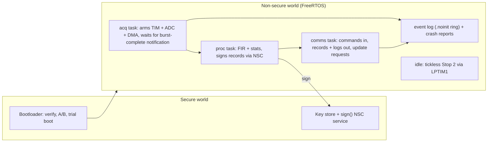

# Capstone: secure, updatable, low-power data acquisition node

**Time:** 4 h+ (typically 15–25 h of self-directed work) · **Board:** NUCLEO-L552ZE-Q (or NUCLEO-U575ZI-Q) · **Uses:** every module

Build the firmware for a battery-powered data-acquisition node, then **present it with measured evidence, not claims**. Every requirement below names the evidence that proves it.

## Brief

The node:

- samples an analogue sensor with a **timer-triggered ADC and DMA** in bursts (for example 1 s at 10 kSPS, once a minute)
- **filters** each burst (reuse your Lab 4 FIR, as a tested library from Lab 11) and keeps summary statistics
- **logs** events (bursts, errors, resets) to a ring buffer that survives a reset
- **communicates** over UART or USB: commands in, results and logs out
- **sleeps** in Stop 2 between bursts
- keeps a **signing key in the Secure world** and signs every result record it sends
- accepts **signed firmware updates** that survive power loss and revert if broken

## Requirements and evidence

| # | Requirement | Evidence to present | Module |
| --- | --- | --- | --- |
| R1 | Custom startup and linker script, no vendor startup files | map-file walkthrough: every section, its VMA/LMA, and why it's where it is | 2 |
| R2 | Sampling ISR jitter < 500 ns | logic-analyser capture (or self-timed timer-capture numbers) under full load | 3, 4 |
| R3 | Zero dropped samples at the target rate | sequence-counter log over **1 hour** | 4 |
| R4 | FreeRTOS with ≥ 3 tasks, no priority inversion | SystemView/Tracealyzer or built-in trace showing a lock handed over with inheritance; priority map | 6 |
| R5 | Average current < 50 µA at 1 burst/min | power-profiler capture + energy budget table matching it within 20% | 7 |
| R6 | Crash dump reported on next boot | live demo: inject a fault, show the report, decode it to a line with addr2line | 8 |
| R7 | Signing key in the Secure world; MPU stack guards on every task | a Non-secure read of the key faults (SecureFault report); a deliberate overflow is caught by a guard | 9 |
| R8 | Signed A/B update surviving power cuts | 20-round random power-cut run, all rounds boot a valid image; tamper and rollback rejected | 10 |
| R9 | CI with host tests, sanitizers and size report | pipeline link: green run + a merge request with the size delta | 11 |

### Porting notes

- The course BSP covers the **L552** with TrustZone off. Lab 9 shows the TrustZone split; the capstone needs both, so the FreeRTOS application runs **Non-secure** (FreeRTOS port `GCC/ARM_CM33/non_secure` with the secure context-save side in the Secure image, or `ARM_CM33_NTZ` if all RTOS-aware code stays Non-secure and the Secure world only offers NSC services).
- **U575** users: port `bsp/l552` to `bsp/u575` (vectors via `tools/gen_vectors.py`, the CMSIS device pack `cmsis_device_u5`, LPUART1 on PG7/PG8, GPDMA instead of DMA1). LPBAM can take R5 far below 50 µA.
- The Lab 10 bootloader targets the H723's single-bank flash. On the L552 you can use **bank swap** (`SWAP_BANK`) instead of slot-specific links. Say which you chose and why.

## Suggested architecture

## Milestones (suggested)

1. Bare-metal skeleton on your own startup and linker script, with the crash dump (R1, R6).
2. Acquisition pipeline at full rate on the bench, with the 1-hour zero-loss run (R2, R3).
3. FreeRTOS tasks and priority map, with a trace (R4).
4. Low power: Stop 2, tickless idle, leakage hunt, budget (R5).
5. TrustZone split and MPU guards (R7).
6. Bootloader and update path, then the power-cut run (R8).
7. CI throughout, not at the end (R9).

## Deliverables

1. **Repository** with the firmware, tests, pipeline and a README that builds from a clean checkout.
2. **10-minute demo**: boot, a burst, a signed record verified on the host, a live update with a power cut, a crash report.
3. **2-page design note** (template below).

### Design note template

1. **Interrupt priority map**: table of sources, priorities, max duration and rate, BASEPRI threshold, worst-case blocking per level (Module 3).
2. **Memory map**: flash and RAM regions for the Secure and Non-secure images, bootloader and slots; where the stacks, DMA buffers and `.noinit` areas are, and why (Modules 1, 2, 5, 9, 10).
3. **Threat model**: assets, attackers, what you prevent, detect, or accept (Module 9).
4. **Energy budget**: the phase table and the battery-life estimate (Module 7).
5. **Known limitations**: what you'd do with another two weeks.

## Assessment

Each requirement is scored 0–3:

| Score | Meaning |
| --- | --- |
| 0 | missing |
| 1 | partial: works sometimes, or no evidence |
| 2 | met, with the evidence listed |
| 3 | met, with excellent evidence (margins quantified, failure modes explored) |

**Pass: 18 of 27, with no zero on R7 (security) and R8 (update).** The design note and demo are required, not scored separately: a requirement without evidence in them scores at most 1.
