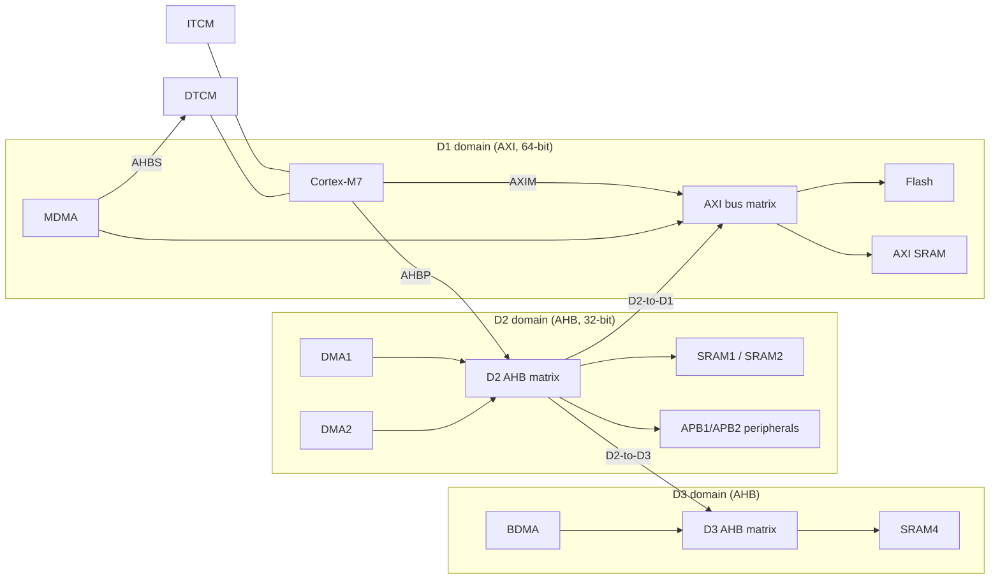

# Module 1: Cortex-M architecture deep dive

**Time:** 5 h (3 h theory, 2 h lab) · **Board:** NUCLEO-H723ZG · **Lab:** [Map the machine](lab/README.md)

Reason about a Cortex-M part from the ARM architecture first and the vendor reference manual second. The architecture tells you what every Cortex-M part does the same way: the memory map, exception model, register file and debug components. The reference manual tells you what this particular chip added: buses, memories, peripherals. Engineers who mix the two up write code that works on one part and breaks on the next.

## Learning objectives

By the end of this module you can:

1. Tell ARMv6-M, ARMv7-M, ARMv7E-M, ARMv8-M Baseline and Mainline, and ARMv8.1-M apart, and say what each adds.
2. Navigate the fixed 4 GB memory map, including the Private Peripheral Bus (PPB) at `0xE0000000`.
3. Explain how the STM32H7 bus matrix and its separate SRAM banks affect latency and which DMA can reach which memory.
4. Use Thread vs Handler mode, privileged vs unprivileged execution, and MSP vs PSP correctly.

---

## 1.1 One architecture, many cores

"Cortex-M4" names a **core** (an implementation). "ARMv7E-M" names an **architecture profile** (a contract). Code written against the contract ports across cores; code that relies on core details (cycle counts, cache sizes) does not.

| Architecture | Cores | Adds over the previous row |
| --- | --- | --- |
| ARMv6-M | M0, M0+, M1 | Baseline: 16-bit Thumb plus a few 32-bit instructions, NVIC with 4 priority levels, no exclusives, no hardware divide, no BASEPRI/FAULTMASK |
| ARMv7-M | M3 | Full Thumb-2, hardware divide, LDREX/STREX, BASEPRI and FAULTMASK, configurable fault handlers, PMSAv7 MPU, optional bit-banding |
| ARMv7E-M | M4, M7 | DSP extension (single-cycle MAC, SIMD on 8/16-bit lanes, saturating arithmetic), optional FPU (SP on M4, SP or DP on M7) |
| ARMv8-M Baseline | M23 | v6-M plus hardware divide, exclusives, optional TrustZone-M, PMSAv8 MPU |
| ARMv8-M Mainline | M33, M35P | v7E-M feature set plus optional TrustZone-M, stack limit registers (MSPLIM/PSPLIM), PMSAv8 base/limit MPU |
| ARMv8.1-M | M55, M85 | Helium/MVE vector extension, low-overhead loops, PACBTI (M85), RAS |

Things to notice:

- **ARMv6-M has no exclusive loads/stores.** Lock-free algorithms that rely on LDREX/STREX (Module 5) do not port to an M0+. You have to disable interrupts instead.
- **TrustZone is optional even on ARMv8-M.** Read the device datasheet. Every STM32L5/U5 has it, but not every M33 from every vendor does.
- **Bit-banding was removed** from the M7 and from all of ARMv8-M. Code that writes `*(volatile uint32_t *)0x42000000` is not portable.

The course boards cover both ends of the modern range:

| | NUCLEO-H723ZG | NUCLEO-L552ZE-Q |
| --- | --- | --- |
| Core | Cortex-M7 r1p2, ARMv7E-M | Cortex-M33, ARMv8-M Mainline |
| Clock (course BSP) | 400 MHz (VOS1) | 16 MHz HSI (110 MHz max) |
| Caches | 32 KB I + 32 KB D, 32-byte lines | none in the core (ICACHE peripheral on flash) |
| FPU | double precision (FPv5-D16) | single precision (FPv5-SP-D16) |
| Security | MPU (PMSAv7) | TrustZone-M, SAU, PMSAv8 MPU |

> **About 550 MHz.** The H723 datasheet's headline 550 MHz needs voltage scale 0 **and** the `CPUFREQ_BOOST` option bit in `FLASH_OPTSR2`. Without that bit the limit is 520 MHz in VOS0. The course BSP runs at 400 MHz in VOS1, which needs no option-byte changes and leaves thermal margin. Lab targets quote both numbers where it matters. If you want 520/550 MHz, use STM32CubeMX's clock tool to compute the PLL dividers, then set VOS0 before switching.

## 1.2 Pipelines and why old cycle counts lie

| Core | Pipeline | Notes |
| --- | --- | --- |
| M0+ | 2-stage | Branches cost 2 cycles; very predictable |
| M3/M4 | 3-stage (fetch, decode, execute) | Branch speculation in fetch; most ALU ops 1 cycle |
| M33 | 3-stage | Similar timing to M4 |
| M7 | 6-stage, dual-issue superscalar | Branch target address cache, in-order issue; two instructions per cycle when they pair |

On an M3 you could count cycles from the instruction set summary. On an M7 you can't: the cycle count of a loop depends on pairing, branch prediction, cache hits, TCM vs AXI placement and flash wait states. So in this course **you measure, you don't predict**. The DWT cycle counter (§1.6) is the tool for that.

## 1.3 The fixed memory map

Every Cortex-M uses the same 4 GB layout. Vendors fill regions in; they cannot move them.

```
0xFFFFFFFF ┌─────────────────────────────┐
           │ Vendor system region         │
0xE0100000 ├─────────────────────────────┤
           │ PPB: NVIC, SCB, SysTick,    │  Private Peripheral Bus: core registers,
           │ MPU, DWT, ITM, FPB, TPIU...  │  same address on every Cortex-M
0xE0000000 ├─────────────────────────────┤
           │ External device (1 GB)       │  Device memory, execute-never
0xA0000000 ├─────────────────────────────┤
           │ External RAM (1 GB)          │  FMC/OCTOSPI memories
0x60000000 ├─────────────────────────────┤
           │ Peripheral (512 MB)          │  Device memory, execute-never
0x40000000 ├─────────────────────────────┤
           │ SRAM (512 MB)                │  Normal memory, WBWA cacheable by default
0x20000000 ├─────────────────────────────┤
           │ Code (512 MB)                │  Normal memory, WT cacheable by default
0x00000000 └─────────────────────────────┘
```

The default attributes matter more than they look. Without an MPU configuration:

- Code in the **Peripheral** and **Device** regions is **execute-never**. Jumping to a corrupted function pointer that lands in `0x4xxxxxxx` gives a MemManage fault (or a HardFault if MemManage is disabled), not a random walk.
- The **SRAM region is cacheable, write-back, write-allocate** on the M7. Any DMA buffer in `0x20000000`–`0x3FFFFFFF` (except the TCMs, which are never cached) is cached. Module 5 deals with what that means.

### STM32H723 inside that map

| Region | Address | Size | Bus | Who can reach it |
| --- | --- | --- | --- | --- |
| ITCM | `0x00000000` | 64 KB (up to 256 KB) | CPU ITCM port | CPU, MDMA (via AHBS) |
| Flash | `0x08000000` | 1 MB, 8 × 128 KB sectors | AXI (D1) | CPU, MDMA, DMA1/2 |
| DTCM | `0x20000000` | 128 KB | CPU DTCM port | CPU, MDMA (via AHBS) |
| AXI SRAM | `0x24000000` | 128 KB + 192 KB shared | AXI (D1) | CPU, MDMA, DMA1/2 |
| SRAM1/2 | `0x30000000` | 16 + 16 KB | AHB (D2) | CPU, DMA1/2, MDMA |
| SRAM4 | `0x38000000` | 16 KB | AHB (D3) | CPU, all DMAs incl. BDMA |
| Backup SRAM | `0x38800000` | 4 KB | AHB (D3) | CPU, battery-backed |

ITCM size is set by the `TCM_AXI_SHARED` option bytes, which move up to 192 KB between ITCM and AXI SRAM. The course linker script uses only the guaranteed 64 KB ITCM and 128 KB AXI.

## 1.4 Buses, masters and slaves on the STM32H7

The H7 has three power/clock domains, each with its own interconnect:



Consequences you will hit in practice:

- **The TCMs are private to the core.** DMA1, DMA2 and BDMA have no path to ITCM or DTCM. A DMA aimed at DTCM gets a bus error and the stream stops with its transfer-error flag set. You'll see this happen in the lab. Only MDMA reaches the TCMs, through the core's AHBS slave port.
- **BDMA only sees the D3 domain**, so its buffers must be in SRAM4. That is also why SRAM4 is the place for data that must survive while D1/D2 are powered down.
- **Every hop costs latency.** CPU access to DTCM takes 0 wait states. AXI SRAM goes through the AXI matrix, and SRAM4 crosses two bridges. Caches hide most of this for the CPU. They do nothing for DMA.
- **Contention is per slave.** The CPU and DMA1 can both run at full speed if they hit different SRAM banks, and they stall each other if they hit the same one. Module 4 uses this when placing buffers.

## 1.5 Registers, modes and stacks

```
R0–R3, R12      argument/scratch (caller-saved, stacked by hardware on exception entry)
R4–R11          callee-saved
R13 (SP)        banked: MSP or PSP (and on ARMv8-M with TrustZone, Secure and Non-secure copies of each)
R14 (LR)        return address, or EXC_RETURN inside an exception handler
R15 (PC)
xPSR            APSR (flags) | IPSR (current exception number) | EPSR (Thumb bit, IT state)
PRIMASK         1 = mask all configurable-priority exceptions
FAULTMASK       1 = also mask HardFault-level priority (v7-M+)
BASEPRI         mask exceptions at or below this priority (v7-M+)
CONTROL         nPRIV (bit 0), SPSEL (bit 1), FPCA (bit 2), SFPA (bit 3, v8-M)
```

Two modes and two privilege levels give three combinations you'll actually use:

| Mode | Privilege | Stack | Typical use |
| --- | --- | --- | --- |
| Handler | always privileged | always MSP | interrupts, exceptions, the RTOS kernel's PendSV/SVC |
| Thread | privileged | MSP | bare-metal `main()` after reset |
| Thread | unprivileged | PSP | RTOS tasks, MPU-isolated application code |

- `CONTROL.SPSEL` (bit 1) selects PSP for Thread mode. In Handler mode it is ignored, because handlers always use MSP.
- `CONTROL.nPRIV` (bit 0) drops Thread mode to unprivileged. Unprivileged code **cannot set it back**. The only way up is an exception (usually `SVC`), and the handler changes CONTROL on its behalf.
- After writing CONTROL, execute an `ISB` so the following instructions use the new stack and privilege.

```c
/* Switch Thread mode to the process stack, then drop privilege. */
__set_PSP((uint32_t)&task_stack[STACK_WORDS]);
__set_CONTROL(__get_CONTROL() | CONTROL_SPSEL_Msk);
__ISB();
__set_CONTROL(__get_CONTROL() | CONTROL_nPRIV_Msk);
__ISB();
```

Why two stacks? Interrupts always push onto MSP. With tasks on PSP, each task's stack only needs room for its own call depth plus one exception frame. Without PSP, it would need room for the worst-case nesting of every interrupt in the system. That's the memory argument for PSP. The robustness argument is that a task overflowing its PSP stack cannot corrupt the stack the interrupt handlers run on.

## 1.6 Memory types and the system control space

The architecture defines memory **types**, which control ordering, merging and speculation:

| Type (v7-M name) | v8-M name | Reordering | Speculative reads | Used for |
| --- | --- | --- | --- | --- |
| Normal | Normal | allowed | allowed | RAM, flash |
| Device | Device-nGnRE | not reordered with other Device accesses | no | peripherals |
| Strongly-ordered | Device-nGnRnE | not reordered with any access | no | PPB, sensitive registers |

These come from the default memory map, or from the MPU when it is enabled. Module 5 returns to them; Module 9 programs the MPU.

The **System Control Space** (`0xE000E000`) inside the PPB holds the core's own registers:

| Block | Base | What you use it for |
| --- | --- | --- |
| SysTick | `0xE000E010` | 24-bit system timer, RTOS tick |
| NVIC | `0xE000E100` | enable, pend, priority for each IRQ |
| SCB | `0xE000ED00` | CPUID, VTOR, AIRCR (priority grouping, reset), SCR (sleep), SHCSR, fault status registers, CPACR (FPU), cache maintenance (M7) |
| MPU | `0xE000ED90` | memory protection regions |
| DWT | `0xE0001000` | cycle counter, watchpoints, PC sampling |
| ITM | `0xE0000000` | stimulus ports for printf-style tracing over SWO |
| FPB | `0xE0002000` | hardware breakpoints, flash patching |

CMSIS gives these as `SysTick`, `NVIC`, `SCB`, `MPU`, `DWT`, `ITM`, `DCB` structs, so you never need raw addresses.

### The DWT cycle counter

The single most useful measurement tool in the course:

```c
DCB->DEMCR |= DCB_DEMCR_TRCENA_Msk;   /* power up DWT/ITM */
DWT->LAR    = 0xC5ACCE55;             /* Cortex-M7 only: unlock CoreSight registers */
DWT->CYCCNT = 0;
DWT->CTRL  |= DWT_CTRL_CYCCNTENA_Msk;

uint32_t t0 = DWT->CYCCNT;
do_work();
uint32_t cycles = DWT->CYCCNT - t0;   /* unsigned arithmetic survives one wrap */
```

The M7 `LAR` write is the one people forget. Without it the counter silently stays at zero on some parts and debug sessions (the debugger unlocks it), so code that "works under the debugger" reads 0 in the field. The course BSP's `dwt_init()` (`bsp/common/dwt.h`) does it for you.

Measurement hygiene:

- Read `CYCCNT` once for overhead and subtract it. On the M7 the read itself takes a few cycles.
- Run the measured code at least twice and report both, cold (first run) and warm (caches and branch predictor primed).
- Make sure the compiler can't optimise away what you measure: use the result, or pass it through a `volatile` or `__asm volatile("" :: "r"(x) : "memory")`.

## 1.7 Caches in one page (preview of Module 5)

The M7's L1 caches sit between the core's AXIM port and the AXI matrix. On the H723 they are 32 KB each, 4-way (data) / 2-way (instruction), with 32-byte lines.

- **TCMs are never cached** and don't need to be: they already run at core speed.
- Enabling the caches typically speeds up code running from flash and data in AXI SRAM by 2–10×. You will measure the exact figure in the lab.
- CMSIS provides `SCB_EnableICache()`, `SCB_EnableDCache()`, `SCB_CleanDCache_by_Addr()`, `SCB_InvalidateDCache_by_Addr()`.
- **DMA does not see the cache.** That is the root of a whole class of bugs, and the subject of Module 5.

## Checklist before you start any new Cortex-M part

- [ ] Which architecture profile? Exclusives? FPU (SP/DP)? DSP? TrustZone?
- [ ] How many NVIC priority bits does the vendor implement? (`__NVIC_PRIO_BITS` in the device header: 4 on the STM32H7, 3 on the STM32L5.)
- [ ] Which memories exist, at what addresses, on which bus, reachable by which DMA?
- [ ] Is there a cache? Are the DMA buffers in cacheable memory?
- [ ] What's the flash wait-state table against voltage scale and clock?
- [ ] Which errata apply? (ST errata sheet ES0491 for the H72x/H73x.)

## Knowledge check 1

Attempt closed-book. Answers are on the `solutions` branch (`docs/answer-key.md`).

1. Which register selects whether Thread mode uses MSP or PSP?
2. Why does a DMA1 transfer into DTCM fail on STM32H7?
3. Name two features ARMv8-M Mainline adds over ARMv7-M.
4. True or false: bit-banding is available on Cortex-M7.

## Further reading

- Arm, *ARMv7-M Architecture Reference Manual* (DDI 0403), chapters B1 (system level programmers' model) and B3 (system address map).
- Arm, *Cortex-M7 Technical Reference Manual*, chapters on the memory system and the L1 caches.
- ST, *RM0468 STM32H723/733, H725/735 and H730 reference manual*: "System and memory overview" (bus matrix, memory map).
- ST, *AN4891 STM32H7 system architecture and performance*: measured latencies per memory and master.
- Joseph Yiu, *The Definitive Guide to Arm Cortex-M23 and Cortex-M33 Processors*, chapters 4–6.
