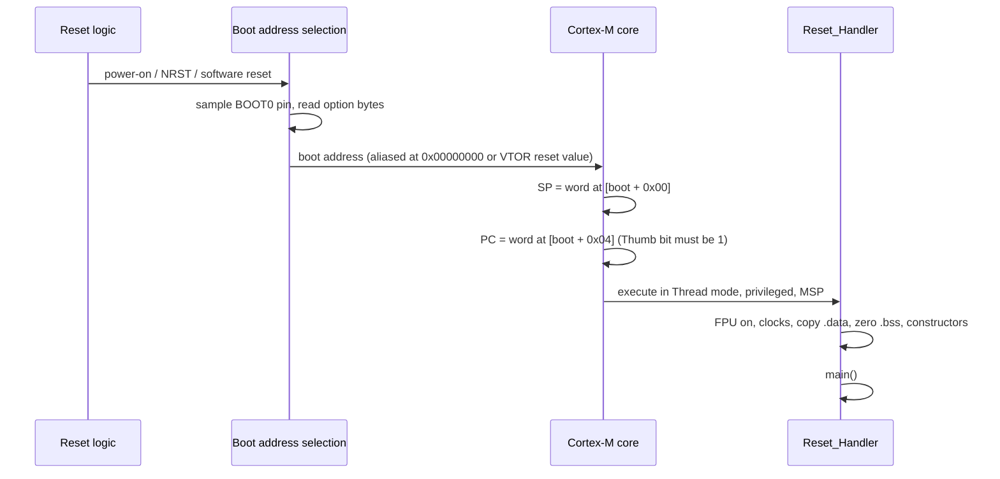

# Module 2: Boot, startup code and linker scripts

**Time:** 5 h (2.5 h theory, 2.5 h lab) · **Board:** NUCLEO-H723ZG · **Lab:** [Bare-metal from zero](lab/README.md)

By the end, you can bring up a Cortex-M from reset with no vendor startup files and explain every byte that runs before `main()`. Most "mystery" field bugs live in the code nobody reads: a stack that silently overlaps `.bss`, a `.data` section initialised from the wrong flash address, an FPU instruction executed before the FPU is on. This module removes the mystery.

## Learning objectives

1. Trace the reset sequence: boot pins and option bytes, vector table fetch of the initial SP and `Reset_Handler`, and VTOR relocation.
2. Write a C startup file that copies `.data`, zeroes `.bss`, enables the FPU, sets up clocks and caches, and runs C++ static constructors.
3. Write and debug a GNU ld linker script using `MEMORY`, `SECTIONS`, VMA vs LMA, `KEEP`, `ALIGN` and custom sections.
4. Read a map file and size output to find what is eating flash and RAM.

---

## 2.1 From power-on to the first instruction



**Where does the core boot from?** That's vendor-defined:

| Device | Mechanism | Default |
| --- | --- | --- |
| STM32H7 | BOOT0 pin picks option byte `BOOT_ADD0` or `BOOT_ADD1`, each holding the upper 16 bits of a boot address | BOOT0 = 0 → `0x0800` (user flash); BOOT0 = 1 → `0x1FF0` (system bootloader) |
| STM32L5 (TZEN = 0) | BOOT0 pin / `nBOOT0` option bit picks `NSBOOTADD0` or `NSBOOTADD1` | user flash, or system memory |
| STM32L5 (TZEN = 1) | boots secure from `SECBOOTADD0`; the boot lock (`BOOT_LOCK`) can force it | secure flash at `0x0C000000` |

**The first two words** of the vector table are the only data the core reads by itself. Everything else is up to software.

- Word 0 is the initial main stack pointer. It must be 8-byte aligned (AAPCS) and point **one past** the top of the stack, because the stack is full-descending.
- Word 1 is the address of `Reset_Handler` **with bit 0 set** (Thumb). The linker sets the bit automatically for a function symbol. If you hand-write an address without it, you get a UsageFault (INVSTATE) on the very first instruction, which escalates to HardFault and then to lockup.

**VTOR.** On ARMv7-M and ARMv8-M the vector table can live anywhere, at an alignment of the table size rounded up to a power of two (minimum 128 bytes). The H723 has 163 device IRQs + 16 system vectors = 179 words = 716 bytes, so its table must be 1024-byte aligned. Get that wrong and the low address bits are silently ignored, so the core fetches handlers from the wrong place.

## 2.2 What the startup code must do, in order

```c
void Reset_Handler(void)
{
    /* 1. FPU on, before any C code that could touch an FP register. */
    SCB->CPACR |= (3u << 20) | (3u << 22);   /* CP10, CP11 full access */
    __DSB(); __ISB();

    /* 2. Anything the copy/zero loops depend on (clock gates for D2 SRAM on H7). */
    SystemInit();

    /* 3. .data: copy initial values from flash (LMA) to RAM (VMA). */
    for (uint32_t *d = &_sdata, *s = &_sidata; d < &_edata; ) *d++ = *s++;

    /* 4. .bss: zero. */
    for (uint32_t *d = &_sbss; d < &_ebss; ) *d++ = 0;

    /* 5. C++ constructors, __attribute__((constructor)), .preinit/.init arrays. */
    __libc_init_array();

    /* 6. Application. */
    main();
    for (;;) { }   /* main() must not return on bare metal */
}
```

Why each step is where it is:

1. **FPU first.** With `-mfloat-abi=hard`, GCC may use `s0`–`s31` as spill space or for `memcpy`-like moves in **any** function, including your copy loops. If CP10/CP11 are disabled, the first such instruction raises a NOCP UsageFault. Knowledge check question 3 is about exactly this.
2. **Clock gates and memory controllers.** On the H7, D2 SRAM1/2/3 need their RCC enable bits before you can zero a `.bss` section placed there. Boards with external SDRAM need the FMC configured before `.data` can be copied to it.
3. **Before `main()`, no C library and no initialised globals.** Code running before step 3 must not read any global. It holds garbage.
4. **The clock tree** can be set in `SystemInit()` (CMSIS convention) or early in `main()`. The course BSP does it in `board_init()` from `main()`, so a debugger can step through it with RAM already initialised.

### Writing it in C vs assembly

A C `Reset_Handler` is fine on Cortex-M because the hardware has already loaded SP. Write it in assembly only when you must run code before the stack is usable: external RAM holding the stack, or stack-limit registers to program first. Mark the C version `noreturn`, and don't let it use more than a few words of stack.

### Weak handlers and catching the unexpected

```c
void Default_Handler(void) { for (;;) { } }
void USART3_IRQHandler(void) __attribute__((weak, alias("Default_Handler")));
```

Every vector defaults to `Default_Handler`, and you override it just by defining a function with the same name. Two traps:

- **A typo in the handler name** (`USART3_IRQhandler`) compiles fine. Your function is never called, and the interrupt lands in `Default_Handler` forever. Read IPSR in the debugger, subtract 16, and you have the IRQ number.
- An infinite loop in `Default_Handler` makes the watchdog the only way out. In production, record the IPSR value in `.noinit` and reset (Module 8 builds this).

The course BSP generates the IRQ part of the vector table from the CMSIS device header (`tools/gen_vectors.py`), so the slot order can't drift from the hardware.

## 2.3 The linker script

### MEMORY: what exists

```ld
MEMORY
{
  ITCM  (rwx) : ORIGIN = 0x00000000, LENGTH = 64K
  FLASH (rx)  : ORIGIN = 0x08000000, LENGTH = 1024K
  DTCM  (rw)  : ORIGIN = 0x20000000, LENGTH = 128K
  AXI   (rw)  : ORIGIN = 0x24000000, LENGTH = 128K
}
```

The attribute letters (`rwx`) only decide where *unassigned* input sections may go. They do not protect anything at run time.

### SECTIONS: what goes where

```ld
SECTIONS
{
  .isr_vector : { KEEP(*(.isr_vector)) } > FLASH

  .text : {
    *(.text .text.*)
    KEEP(*(.init)) KEEP(*(.fini))
  } > FLASH

  .rodata : { *(.rodata .rodata.*) } > FLASH

  .data : {
    _sdata = .;
    *(.data .data.*)
    . = ALIGN(4);
    _edata = .;
  } > DTCM AT> FLASH            /* VMA in DTCM, LMA in FLASH */
  _sidata = LOADADDR(.data);

  .bss (NOLOAD) : {
    _sbss = .;
    *(.bss .bss.*) *(COMMON)
    . = ALIGN(4);
    _ebss = .;
  } > DTCM
}
```

### VMA vs LMA

Every output section has two addresses:

- **VMA** (virtual memory address): where the code expects it to be at run time. All references in the code use this address.
- **LMA** (load memory address): where its bytes are stored in the image that gets flashed.

For `.text` they are equal. For `.data` the VMA is in RAM and the LMA is in flash, and the startup copy loop is what moves the bytes. `> DTCM AT> FLASH` says exactly that. `LOADADDR(.data)` gives the startup code the flash address to copy from.

The same mechanism runs code from RAM: put a function in `.itcm_text`, give the section VMA in ITCM and LMA in flash, and copy it at startup. GNU ld automatically inserts a long-branch veneer when flash code calls into ITCM, because the 16 MB distance is out of `BL` range. You'll see `__func_veneer` symbols in the map file.

### KEEP, garbage collection and ALIGN

`-ffunction-sections -fdata-sections` put every function and variable in its own input section, and `-Wl,--gc-sections` drops every section nothing references. That typically saves 10–40% of flash, but it also drops things that are referenced only by hardware:

- the vector table (the core reads it; no code does)
- a firmware header read by the bootloader
- `.init_array` constructor tables

`KEEP(*(.isr_vector))` marks a section as a GC root. If the vector table disappears, the chip boots from whatever lands at `0x08000000`, typically `.text`. The symptom is a HardFault before `main()`, or no sign of life at all.

`ALIGN(n)` moves the location counter up to a multiple of `n`. You need it for VTOR (table-size alignment), for DMA buffers (32-byte cache lines on the M7, Module 5), for MPU regions (Module 9), and for word copies in the startup loops (4).

### Custom sections

```c
/* in C */
__attribute__((section(".noinit"))) static uint32_t boot_count;
__attribute__((section(".itcm_text"), noinline)) void control_loop(void) { ... }
```

```ld
/* in the linker script */
.noinit (NOLOAD) : { *(.noinit .noinit.*) } > DTCM
```

`NOLOAD` means the section takes space at the VMA but has no bytes in the image. Startup doesn't touch `.noinit`, so its contents survive a software reset or watchdog reset. They don't survive a power cycle, so always validate them with a magic number or a CRC.

### Orphan sections

An input section that matches no rule is an **orphan**. ld places it next to a similar section, often somewhere you didn't intend. Use `-Wl,--orphan-handling=warn` to list them. A common example is `.ARM.exidx` from C++ or from `-funwind-tables`.

## 2.4 Stack and heap sizing

The stack is the one memory region nothing checks by default on ARMv7-M.

**Static analysis.** `-fstack-usage` writes a `.su` file per object, listing each function's frame size and whether it is `static`, `dynamic` or `bounded`. Combine it with the call graph (`-fcallgraph-info=su` on GCC 10+, or tools like `puncover`) to get the worst-case path. Static analysis can't see through function pointers, recursion or ISRs nesting on the same stack, so add the deepest interrupt chain by hand.

**Dynamic measurement: stack painting.** Fill the stack with a pattern at boot, run the worst-case scenario, then count untouched words:

```c
#define STACK_PAINT 0xDEADBEEFu
extern uint32_t _sstack[], _estack[];

void stack_paint(void) {           /* call first thing in Reset_Handler, before using much stack */
    uint32_t *sp = (uint32_t *)__get_MSP();
    for (uint32_t *p = _sstack; p < sp - 16; p++) *p = STACK_PAINT;
}

size_t stack_unused_bytes(void) {
    uint32_t *p = _sstack;
    while (p < _estack && *p == STACK_PAINT) p++;
    return (size_t)((uint8_t *)p - (uint8_t *)_sstack);
}
```

**Where to put the stack.** If the stack sits above `.data`/`.bss` (the common default, used by `bsp/h723/h723.ld`), an overflow quietly corrupts globals. If it sits at the **bottom** of RAM (as `bsp/l552/l552.ld` does), an overflow runs off the start of RAM into unmapped or reserved space and faults immediately. ARMv8-M adds `MSPLIM`/`PSPLIM`, which fault on overflow regardless of placement. On ARMv7-M, an MPU guard region gives the same effect (Module 9).

**Heap.** Many production systems allow `malloc` only during initialisation, or not at all. Fragmentation is unbounded, timing is not deterministic, and a failure turns up months later. The course `_sbrk` (`bsp/common/syscalls.c`) returns `ENOMEM` at the end of `.heap` instead of growing into the stack. Note that newlib-nano's `printf` calls `malloc` for stdout's buffer on first use, unless you call `setvbuf(stdout, NULL, _IONBF, 0)`.

## 2.5 Toolchain flags that matter

| Flag | Why |
| --- | --- |
| `-mcpu=cortex-m7 -mthumb -mfpu=fpv5-d16 -mfloat-abi=hard` | Must match on **every** object and the link step; a mismatch gives "uses VFP register arguments" link errors |
| `-ffunction-sections -fdata-sections` + `-Wl,--gc-sections` | Per-function sections so unused code can be dropped |
| `-fno-common` | Default since GCC 10; makes duplicate tentative definitions a link error instead of a silent merge |
| `-Wl,-Map=out.map,--cref` | The map file, with a cross-reference table of who uses each symbol |
| `-Wl,--print-memory-usage` | Per-region usage summary on every build |
| `-flto` | Whole-program optimisation; typically 5–15% smaller, but harder to debug and can break `section` attributes on functions inlined across files |
| `--specs=nano.specs` | newlib-nano: smaller `printf`/`malloc`, no `%f` unless `-u _printf_float` |

**C library choices.**

| Library | Size | Notes |
| --- | --- | --- |
| newlib | large | full-featured, reentrancy via `struct _reent` |
| newlib-nano | small | ships with Arm GNU Toolchain; size-optimised `printf`, `malloc` |
| picolibc | small | newlib fork with a cleaner stdio and no `_reent` overhead; the Zephyr default |

## 2.6 Reading a map file

The map file answers three questions: what is in my image, where is it, and why was it linked in.

```
.text           0x080002d0     0x1588
 .text.main     0x080003a4       0x8c CMakeFiles/lab02.dir/main.c.obj
 .text._printf_i 0x08000a10     0x1f4 .../libc_nano.a(libc_a-nano-vfprintf_i.o)
```

- **Archive member list** (top of the file) explains *why* each library object was pulled in: `libc_a-nano-vfprintf.o` was needed by `main.c.obj (printf)`.
- **Discarded input sections** lists what `--gc-sections` removed.
- **Memory configuration / Linker script and memory map** gives every output section with its VMA, size and the input sections inside it.

Quick tools:

```sh
arm-none-eabi-size -A build/.../firmware.elf            # per-section sizes
arm-none-eabi-nm -S --size-sort -C firmware.elf | tail  # biggest symbols
arm-none-eabi-objdump -h firmware.elf                   # VMA and LMA per section
```

Then use `bloaty` or `puncover` for size-over-time and per-file breakdowns. Module 11 tracks size per commit in CI.

## Checklist for a new startup file

- [ ] Initial SP 8-byte aligned and pointing at the top of the stack
- [ ] Vector table aligned to its size rounded up to a power of two, and in `KEEP`
- [ ] FPU enabled before any compiled C that might use it
- [ ] Clock gates for every RAM a copy/zero loop touches
- [ ] `.data` copied from `LOADADDR(.data)`; `.bss` zeroed; any RAM-code sections copied
- [ ] `__libc_init_array()` called if you use C++ or constructors
- [ ] `Default_Handler` makes unhandled interrupts visible
- [ ] Map file checked: nothing orphaned, nothing in an unexpected region

## Knowledge check 2

1. What two values does the core load from the vector table at reset, and from which offsets?
2. In a linker script, what is the difference between VMA and LMA for `.data`?
3. Why must the FPU be enabled in CPACR before any code that might use floating point, including compiler-generated code in startup?
4. What does `KEEP()` protect against when using `--gc-sections`?

## Further reading

- *ARMv7-M Architecture Reference Manual*, B1.5.5 "Reset behavior" and B3.2.5 "Vector Table Offset Register".
- GNU ld manual, chapter 3 "Linker Scripts" (sections 3.6 SECTIONS, 3.6.8.2 Output Section LMA).
- ST, *AN2606 STM32 microcontroller system memory boot mode*, for the boot pins and system bootloader per family.
- Memfault Interrupt blog: "From Zero to main(): Bare metal C" and "How to write linker scripts for firmware".
