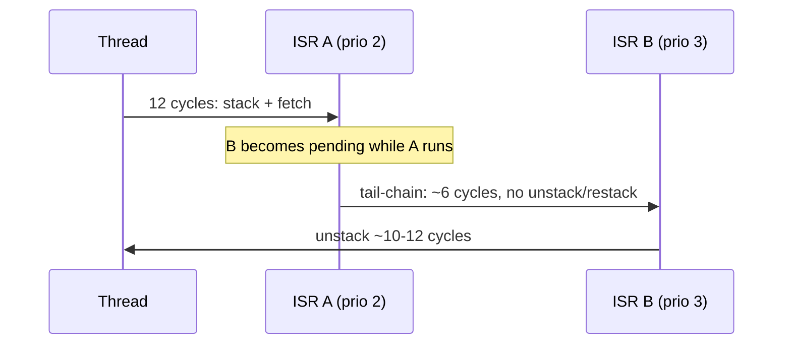

# Module 3: Exceptions, NVIC and low-latency interrupt design

**Time:** 6 h (3 h theory, 3 h lab) · **Board:** NUCLEO-H723ZG · **Lab:** [Latency budget](lab/README.md)

You will design interrupt architectures with bounded, measured latency instead of hoping the priorities work out. The NVIC gives you a lot of control: priorities, preemption, tail-chaining, selective masking. Most latency problems come from using that control without a plan.

## Learning objectives

1. Explain exception entry and return: hardware stacking of R0–R3, R12, LR, PC and xPSR, the EXC_RETURN values, and the 12-cycle best case.
2. Configure priority grouping (preemption vs sub-priority) and reason about the 3 or 4 priority bits an STM32 implements.
3. Use tail-chaining, late arrival and lazy FP stacking deliberately, and know what breaks them.
4. Choose the right critical-section mechanism: PRIMASK, BASEPRI, or none at all (lock-free).

---

## 3.1 The exception model

Every interrupt and fault is an **exception** with a number. In code you mostly see the CMSIS `IRQn` value, which is the exception number minus 16.

| Exc # | IRQn | Exception | Priority | Notes |
| --- | --- | --- | --- | --- |
| 1 | – | Reset | −3 (fixed) | |
| 2 | −14 | NMI | −2 (fixed) | Can't be masked; on STM32 it's driven by the HSE clock security system (CSS) and, on some parts, by flash/RAM ECC or parity errors |
| 3 | −13 | HardFault | −1 (fixed) | Escalation target for every other fault |
| 4 | −12 | MemManage | configurable | MPU violations, execute-never |
| 5 | −11 | BusFault | configurable | Bus errors on fetch or data access |
| 6 | −10 | UsageFault | configurable | Undefined instruction, bad state, divide-by-zero (if enabled), unaligned (if enabled) |
| 7 | −9 | SecureFault | configurable | ARMv8-M with TrustZone only |
| 11 | −5 | SVCall | configurable | `SVC #n` instruction |
| 12 | −4 | DebugMonitor | configurable | |
| 14 | −2 | PendSV | configurable | Software-pended; the context switch (Module 6) |
| 15 | −1 | SysTick | configurable | |
| 16+ | 0+ | IRQ0… | configurable | Device interrupts (163 on the H723) |

MemManage, BusFault and UsageFault are **disabled by default** (`SCB->SHCSR`). Until you enable them, every one of these faults escalates to HardFault. Module 8 enables them so the fault status registers tell you more.

## 3.2 Entry and return

When an exception is accepted, the hardware does this before the first handler instruction:

```
             PSP or MSP (whichever Thread mode was using; MSP if already in Handler mode)
   higher ┌──────────────┐
          │ (aligner)    │  4 bytes of padding if SP was not 8-byte aligned (xPSR bit 9 records it)
          │ xPSR         │
          │ PC           │  return address
          │ LR           │
          │ R12          │
          │ R3           │
          │ R2           │
          │ R1           │
    SP -> │ R0           │  basic frame = 8 words
   lower  └──────────────┘
```

At the same time, it fetches the vector, loads PC, sets LR to an **EXC_RETURN** value, and switches to Handler mode on MSP. This all happens in parallel: on a zero-wait-state system the first handler instruction executes **12 cycles** after the interrupt is recognised (M3/M4/M7/M33; 15 on M0+).

R0–R3 and R12 are caller-saved under the AAPCS, so stacking them is exactly what makes an ordinary C function a valid handler. No `__attribute__((interrupt))` is needed on Cortex-M.

**EXC_RETURN** is a magic value in LR. When it is loaded into PC (`BX LR`, `POP {PC}`), the core performs an exception return:

| EXC_RETURN | Return to | Stack | FP frame |
| --- | --- | --- | --- |
| `0xFFFFFFF1` | Handler mode | MSP | no |
| `0xFFFFFFF9` | Thread mode | MSP | no |
| `0xFFFFFFFD` | Thread mode | PSP | no |
| `0xFFFFFFE1` / `E9` / `ED` | as above | | extended frame (bit 4 = 0) |

Bit 2 says which stack the frame is on (0 = MSP, 1 = PSP), and that's how a HardFault handler finds the faulting frame (Module 8). On ARMv8-M with TrustZone, the low byte also encodes the security state (`0xFFFFFFBC`, `0xFFFFFFFD`, …). Test the individual bits instead of comparing whole values.

### Floating-point context and lazy stacking

If the interrupted code had used the FPU (`CONTROL.FPCA = 1`), the frame grows to the **extended frame**: 8 more words for S0–S15, FPSCR and a reserved word, 26 words in total. Pushing 18 extra words would add latency to every interrupt, so the core uses **lazy stacking** (`FPU->FPCCR.LSPEN`, on by default):

1. On entry, the core **reserves** space for S0–S15/FPSCR but doesn't write it.
2. If the handler never touches the FPU, nothing is saved, and entry costs the same as without FP.
3. The first FP instruction in the handler triggers the deferred save, which costs about 18 cycles plus memory time at that moment.

What breaks it: a handler that uses `float` even trivially, or a compiler that uses FP registers for a struct copy in the ISR. Look for `vpush`/`vstr`/`vmov` in the disassembly of time-critical handlers.

## 3.3 Priorities

The architecture defines an 8-bit priority field per exception. The **lower the number, the more urgent**. Vendors implement only the top bits. Most STM32 families (F4, F7, H7, G4) implement 4 (`__NVIC_PRIO_BITS = 4`), giving 16 levels: `0x00, 0x10, … 0xF0`. The Cortex-M33 STM32L5 and U5 implement only **3** (8 levels). Always use `__NVIC_PRIO_BITS`, never a hard-coded shift. CMSIS `NVIC_SetPriority(irq, p)` takes the **unshifted** value (0–15 with 4 bits) and shifts it for you. Writing `NVIC->IP[n]` directly needs the shifted value.

**Priority grouping** (`AIRCR.PRIGROUP`, set with `NVIC_SetPriorityGrouping()`) splits those bits into:

- **Preemption priority**: decides whether a new exception may interrupt a running handler.
- **Sub-priority**: only orders exceptions that are **pending at the same time** with equal preemption priority. It never causes preemption.

| PRIGROUP | Preempt bits | Sub bits | Preemption levels (4-bit STM32 such as the H7) |
| --- | --- | --- | --- |
| 3 (`NVIC_PRIORITYGROUP_4` in HAL) | 4 | 0 | 16 |
| 4 | 3 | 1 | 8 |
| 5 | 2 | 2 | 4 |
| 6 | 1 | 3 | 2 |
| 7 | 0 | 4 | 1 (no nesting) |

Most RTOS ports (FreeRTOS included) want all bits as preemption priority, which is PRIGROUP 3 on STM32. Sub-priorities are rarely worth the confusion.

> **Equal preemption priority never preempts.** A 200 µs handler at priority 5 blocks every other priority-5 interrupt for 200 µs. The NVIC has no time-slicing. This "priority inversion inside the NVIC" is the most common cause of missed deadlines in bare-metal systems.

## 3.4 Tail-chaining, late arrival, pop preemption



- **Tail-chaining.** If another exception is pending when a handler returns, the core skips the unstack/restack pair and jumps straight to the next handler: about 6 cycles instead of roughly 22–24.
- **Late arrival.** If a higher-priority exception arrives during the stacking of a lower one, the core uses the frame it's already pushing and fetches the higher-priority vector instead.
- **Pop preemption.** If an exception arrives during unstacking, the core abandons the unstack and tail-chains.

What breaks them: anything that makes the handler return to Thread mode between the two exceptions. Examples are a PRIMASK critical section in Thread mode that holds the second interrupt off, or an RTOS that switches context in between.

## 3.5 Critical sections

| Mechanism | What it masks | Cost | When to use |
| --- | --- | --- | --- |
| `__disable_irq()` / PRIMASK | every configurable-priority exception | 1 cycle each way | very short sections on ARMv6-M (which has no BASEPRI), early boot |
| BASEPRI | exceptions with priority value ≥ BASEPRI | 1–2 cycles each way | RTOS kernels, sections shared with **some** ISRs |
| FAULTMASK | everything except NMI | | fault handlers only |
| none (lock-free) | nothing | | single-producer/single-consumer data (§3.7) |

The key idea is that **BASEPRI lets you leave the most urgent interrupts unmasked.** If your motor-control ISR runs at priority 0 and never calls into the shared data structure, mask only priority ≥ 1:

```c
static inline uint32_t crit_enter(void)
{
    uint32_t prev = __get_BASEPRI();
    __set_BASEPRI_MAX(1u << (8u - __NVIC_PRIO_BITS)); /* mask priority values >= 1 */
    __ISB();
    return prev;
}

static inline void crit_exit(uint32_t prev)
{
    __set_BASEPRI(prev);
}
```

`BASEPRI_MAX` only raises the mask (writes are ignored if they'd lower it), so nested critical sections are safe. Always save and restore the previous value, never clear it to 0.

On a Cortex-M7 r0p1 there is an erratum (837070) where a BASEPRI write may not take effect immediately. The workaround is to disable interrupts around it, as FreeRTOS's `ARM_CM7/r0p1` port does. The H723 has r1p2 and is not affected.

## 3.6 The bugs that keep coming back

**1. Clearing the flag too late: the double interrupt.**

```c
void TIM2_IRQHandler(void)
{
    do_work();
    TIM2->SR = ~TIM_SR_UIF;   /* last instruction */
}                             /* exception return: IRQ line still high -> ISR runs again */
```

The store to `TIM2->SR` sits in the core's write buffer and then crosses AXI → AHB → APB bridges. The exception return can finish before the peripheral sees the write, so the NVIC samples the IRQ line still asserted and re-pends the interrupt. On a 400 MHz M7 talking to a 100 MHz APB, this happens every time.

**Fix:** clear the flag **first**. If it has to be last, read it back (`(void)TIM2->SR;`) to force the write to complete. A `__DSB()` only waits for the core's own write buffer, so on the H7 use the read-back.

**2. Non-atomic shared variables.** A 64-bit counter updated in an ISR and read in `main()` can be read half-old, half-new. Module 5 covers this in depth.

**3. Missing `volatile` on a flag polled in `main()`.** The compiler hoists the load out of the loop, and the loop never ends. Also Module 5.

**4. Re-enabling an IRQ inside its own handler,** or calling `NVIC_ClearPendingIRQ` before the peripheral flag is clear. The interrupt just re-pends.

**5. Vector-table typo:** `void EXTI3_IRQhandler(void)` compiles and is never called (Module 2).

## 3.7 Deferred processing

Keep ISRs short: capture data, clear the flag, hand the rest off.

**Top half / bottom half with PendSV.** PendSV is a software-triggered exception you can give the lowest priority:

```c
void ADC_IRQHandler(void)            /* priority 2: fast part */
{
    sample_buf[head++ & MASK] = ADC1->DR;
    SCB->ICSR = SCB_ICSR_PENDSVSET_Msk;   /* request the slow part */
}

void PendSV_Handler(void)            /* priority 15: slow part */
{
    process_samples();
}
```

If you use an RTOS, PendSV belongs to the scheduler. Use a spare device IRQ instead (`NVIC_SetPendingIRQ(unused_IRQn)` or write `NVIC->STIR`), or an RTOS task notification.

**Lock-free SPSC ring buffer.** When exactly one context writes and exactly one reads, no lock is needed, as long as each index is written by only one side and the data is written before the index is published:

```c
#define RB_SIZE 256u                       /* power of two */
struct ring {
    uint8_t buf[RB_SIZE];
    volatile uint32_t head;                /* written only by the producer (ISR) */
    volatile uint32_t tail;                /* written only by the consumer (thread) */
};

bool rb_put(struct ring *r, uint8_t b)     /* producer */
{
    uint32_t h = r->head;
    if (h - r->tail == RB_SIZE) return false;   /* full */
    r->buf[h & (RB_SIZE - 1)] = b;
    __DMB();                               /* data visible before the index */
    r->head = h + 1;
    return true;
}

bool rb_get(struct ring *r, uint8_t *b)    /* consumer */
{
    uint32_t t = r->tail;
    if (r->head == t) return false;        /* empty */
    __DMB();                               /* read the index before the data */
    *b = r->buf[t & (RB_SIZE - 1)];
    r->tail = t + 1;
    return true;
}
```

The indices run freely and wrap at 2³², and `head - tail` is the fill level even across the wrap. On a single-core Cortex-M the `__DMB()` calls mostly act as compiler barriers. They become essential for DMA, for multi-core parts (H745/H755), and as documentation of intent. Module 5 explains this properly.

## 3.8 Measuring latency

Latency from **event** to **first useful instruction** has several components:

```
event ─► peripheral flag ─► NVIC pending ─► [wait: higher/equal ISR, masked section]
      ─► stacking (12 cycles) ─► vector fetch ─► handler prologue ─► your first line
```

Methods, from cheapest to best:

1. **GPIO toggle + logic analyser.** Drive an input edge, toggle an output as the ISR's first statement, and measure the delta. This includes GPIO synchronisation (2 cycles of the GPIO clock on input, plus the AHB write on output).
2. **Timer counter capture.** For a timer-driven ISR, read `TIMx->CNT` as the ISR's first statement. The count since the update event *is* the latency, in timer clocks (5 ns at 200 MHz). Recording min/max gives jitter with no instruments. Lab 3 uses this.
3. **DWT cycle counter** for code-path lengths inside the handler.
4. **ETM trace** (Module 8) for cycle-exact history.

What moves the numbers on an STM32H7:

| Factor | Typical effect at 400 MHz |
| --- | --- |
| Handler and vector table in flash, I-cache cold | +20–100 cycles (flash wait states plus AXI latency on a miss) |
| Handler in ITCM | deterministic, no cache dependency |
| FP context active and handler uses FP | +18 cycles plus the stores |
| A same-or-higher-priority ISR running | its whole remaining duration |
| PRIMASK section in Thread mode | the whole section length |
| Debugger attached with breakpoints | anything; measure detached |

STM32F4/F7 parts hide flash wait states with the **ART accelerator**. The STM32H7 has no ART for the M7 and relies on the L1 I-cache instead. That's why ITCM is the tool for deterministic interrupt code on the H7.

## Designing an interrupt priority map

Write it down, one table per product, before writing the ISRs:

| Priority | Source | Max duration | Max rate | Notes |
| --- | --- | --- | --- | --- |
| 0 | Control loop (TIM1) | 8 µs | 20 kHz | ITCM, no FP save (FP context off), never masked |
| 1 | — | | | BASEPRI threshold for kernel critical sections |
| 2 | ADC DMA HT/TC | 3 µs | 4 kHz | |
| 5 | UART RX DMA idle | 5 µs | 1 kHz | |
| 6–14 | RTOS-aware ISRs | | | may call `…FromISR()` APIs |
| 15 | PendSV, SysTick | | | context switch, tick |

Then check the **worst-case blocking** of every level: the sum of all longer-running work at the same or higher priority that could be active, plus the longest critical section that masks it. The capstone requires this table.

## Knowledge check 3

1. With 4 priority bits and grouping set to 2 bits preempt / 2 bits sub, how many preemption levels exist?
2. What is tail-chaining, and how many cycles does it save versus a full unstack/restack?
3. Why is BASEPRI preferred over PRIMASK for RTOS critical sections?
4. An ISR clears its peripheral's interrupt flag as its last instruction and fires twice per event. Why, and what is the fix?

## Further reading

- *ARMv7-M Architecture Reference Manual*, B1.5 "ARMv7-M exception model".
- Arm application note *AN321 Cortex-M programming guide to memory barrier instructions*, §4.
- Joseph Yiu, *The Definitive Guide to ARM Cortex-M3 and Cortex-M4 Processors*, chapters 7–9 (exceptions, NVIC, low-latency features).
- Arm Community blog: "Cutting through the confusion with ARM Cortex-M interrupt priorities".
- ST, *AN4891* §"Interrupt latency".
