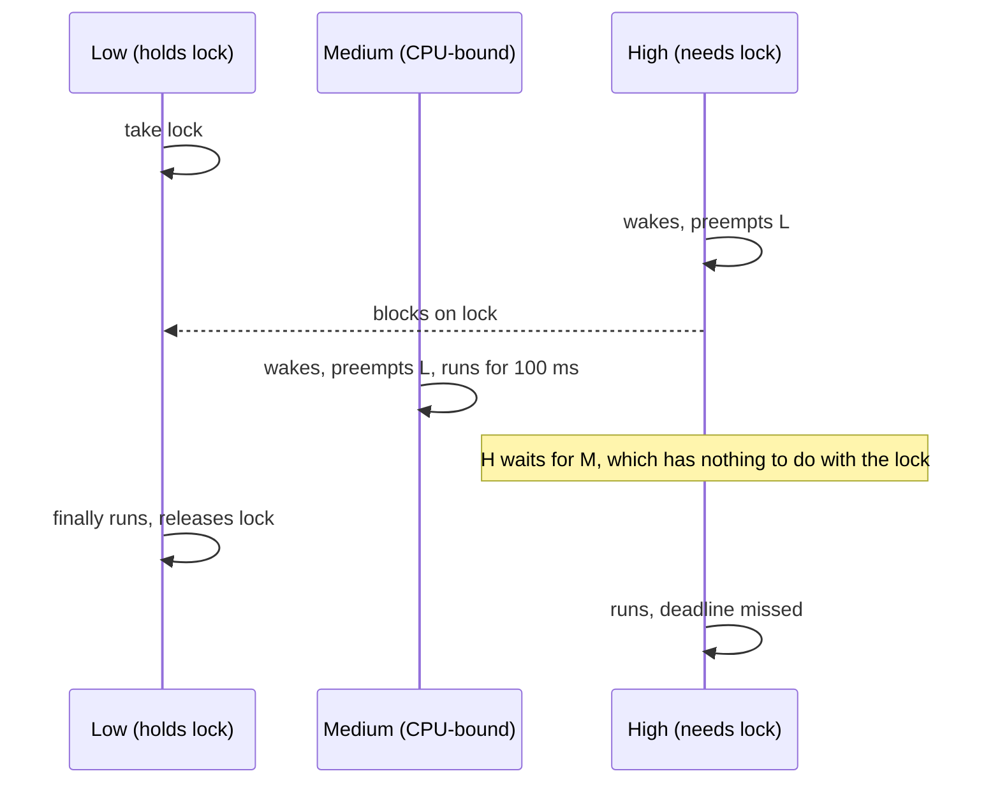

# Module 6: RTOS internals

**Time:** 7 h (3 h theory, 4 h lab) · **Board:** NUCLEO-H723ZG · **Labs:** [6a: Write a 300-line kernel](lab/README.md#lab-6a-write-a-300-line-kernel) · [6b: Fix a broken FreeRTOS app](lab/README.md#lab-6b-fix-a-broken-freertos-app)

Stop treating the RTOS as a black box. You build a minimal preemptive kernel, which shows that a context switch is about 30 instructions and a scheduler is a bitmap and a list. Then you use FreeRTOS knowing what every API call costs and what can go wrong.

## Learning objectives

1. Implement a context switch using SVC to start the first task and PendSV to switch, with a PSP per task.
2. Explain fixed-priority preemptive scheduling, time slicing and tickless idle.
3. Prevent and diagnose priority inversion, deadlock and starvation.
4. Perform basic schedulability analysis: rate-monotonic bound and response-time analysis.

---

## 6.1 What a kernel actually is

```
           ┌──────────── Thread mode, PSP ────────────┐
 task A    │ stack A  [r0-r3,r12,lr,pc,xpsr][r4-r11]  │  ◄─ TCB A.sp
 task B    │ stack B  [ ... saved context ... ]       │  ◄─ TCB B.sp
 idle      │ stack I                                  │
           └──────────────────────────────────────────┘
           ┌──────────── Handler mode, MSP ───────────┐
           │ SysTick: tick++, wake sleepers, slice    │
           │ PendSV:  save current, pick next, restore│
           │ SVC:     start first task / syscalls     │
           │ device ISRs                              │
           └──────────────────────────────────────────┘
```

A task is a **stack plus a TCB** (task control block) holding at least the saved stack pointer, a priority and a state. Everything else (queues, semaphores, timers) is data structures that move TCBs between lists.

## 6.2 The context switch on Cortex-M

The hardware already saves half the context on exception entry: R0–R3, R12, LR, PC and xPSR, onto the stack that was in use, which is the task's PSP. The kernel saves the other half: R4–R11, plus S16–S31 if the task used the FPU.

```asm
PendSV_Handler:
    mrs     r0, psp                 @ r0 = current task's stack
    isb
    ldr     r3, =g_current
    ldr     r2, [r3]                @ r2 = current TCB
    tst     lr, #0x10               @ EXC_RETURN bit 4 == 0: extended FP frame
    it      eq
    vstmdbeq r0!, {s16-s31}         @ save callee-saved FP registers
    stmdb   r0!, {r4-r11, lr}       @ save core registers + EXC_RETURN
    str     r0, [r2]                @ TCB->sp = r0

    mov     r0, #KERNEL_BASEPRI     @ mask kernel-aware ISRs while we pick
    msr     basepri, r0
    dsb
    isb
    bl      kernel_select_next      @ C: g_current = highest-priority ready task
    mov     r0, #0
    msr     basepri, r0

    ldr     r3, =g_current
    ldr     r1, [r3]
    ldr     r0, [r1]                @ r0 = next task's saved sp
    ldmia   r0!, {r4-r11, lr}
    tst     lr, #0x10
    it      eq
    vldmiaeq r0!, {s16-s31}
    msr     psp, r0
    isb
    bx      lr                      @ hardware unstacks the rest
```

Why PendSV:

- **It runs at the lowest priority.** It is pended by SysTick, by `yield()`, or by an ISR that readied a task, and it runs only after **every** other active ISR has finished. The switch therefore never happens in the middle of a nested interrupt, and every ISR sees the task it interrupted.
- **Pending is idempotent.** Five ISRs can each request a switch; PendSV runs once.

Why SVC to start the first task: `kernel_start()` runs in Thread mode on MSP. An `SVC` puts the core into Handler mode, where the handler can load the first task's PSP and return with `EXC_RETURN = 0xFFFFFFFD` (Thread mode, PSP). From then on, Thread mode always runs on PSP.

**Building a new task's stack.** A new task must look exactly as if it had been switched out:

```c
uint32_t *sp = stack + words;            /* top, 8-byte aligned */
*--sp = 0x01000000;                      /* xPSR: Thumb bit */
*--sp = (uint32_t)entry;                 /* PC */
*--sp = (uint32_t)task_exit;             /* LR: where entry() returns to */
sp -= 4;                                 /* R12, R3, R2, R1 */
*--sp = (uint32_t)arg;                   /* R0 */
*--sp = 0xFFFFFFFD;                      /* EXC_RETURN: thread, PSP, no FP */
sp -= 8;                                 /* R11..R4 */
tcb->sp = sp;
```

## 6.3 Scheduling

**Fixed-priority preemptive** is what FreeRTOS, ThreadX, Zephyr and most RTOSs do. The highest-priority ready task always runs. Among equal priorities, **time slicing** rotates them on each tick (`configUSE_TIME_SLICING`).

**O(1) selection with CLZ.** Keep a bitmap of priorities that have at least one ready task. The highest set bit is the answer, in one instruction:

```c
uint32_t ready_mask;                      /* bit p set <=> ready list p not empty */
unsigned top = 31u - __CLZ(ready_mask);   /* highest priority with a ready task */
```

FreeRTOS does exactly this when `configUSE_PORT_OPTIMISED_TASK_SELECTION = 1`, which limits it to 32 priorities.

**The tick.** SysTick increments the tick count, moves tasks whose delay has expired to the ready lists, and pends PendSV if a higher-priority task became ready or the time slice expired. A 1 kHz tick on a 400 MHz M7 costs well under 0.1% of CPU time. Its real cost is **power** (Module 7), which is what tickless idle addresses.

**Tickless idle.** When only the idle task is ready, stop SysTick, program a low-power timer to fire at the next scheduled wake-up, sleep, and on wake-up add the elapsed ticks to the tick count. FreeRTOS: `configUSE_TICKLESS_IDLE`, `portSUPPRESS_TICKS_AND_SLEEP()`. Module 7 builds this.

## 6.4 Synchronisation primitives (FreeRTOS names)

| Primitive | Use for | Notes |
| --- | --- | --- |
| Binary semaphore | ISR → task signalling | no owner, **no priority inheritance** |
| Counting semaphore | counting events or resources | |
| Mutex | mutual exclusion between tasks | has an owner, priority inheritance; never from an ISR |
| Recursive mutex | the same task locks it again | usually a design smell |
| Queue | copying data between tasks or ISR → task | copies by value; costly for big items |
| Event group | waiting for combinations of flags | |
| **Direct-to-task notification** | ISR → task, one waiting task | ~45% faster than a binary semaphore and no RAM for an object; one per task by default (an array with `configTASK_NOTIFICATION_ARRAY_ENTRIES`) |
| Stream / message buffer | byte streams, variable-length messages, one writer and one reader | lock-free in the single-writer/single-reader case |

**From an ISR**, call only the `…FromISR()` variants, and only from interrupts whose priority is numerically **≥ `configMAX_SYSCALL_INTERRUPT_PRIORITY`**. The kernel masks its critical sections with BASEPRI at that level (Module 3 §3.5). ISRs above it are never delayed by the kernel, and must never call it.

```c
/* FreeRTOSConfig.h on STM32 (4 priority bits) */
#define configPRIO_BITS                               4
#define configLIBRARY_LOWEST_INTERRUPT_PRIORITY       15
#define configLIBRARY_MAX_SYSCALL_INTERRUPT_PRIORITY  5
#define configKERNEL_INTERRUPT_PRIORITY      (configLIBRARY_LOWEST_INTERRUPT_PRIORITY << (8 - configPRIO_BITS))
#define configMAX_SYSCALL_INTERRUPT_PRIORITY (configLIBRARY_MAX_SYSCALL_INTERRUPT_PRIORITY << (8 - configPRIO_BITS))
```

Priorities 0–4 are then "zero-latency" interrupts the RTOS never masks, and 5–15 may call `FromISR` APIs.

Why calling a non-ISR API such as `xQueueSend()` from an ISR corrupts the kernel:

- It may try to **block**. An ISR can't block: there's no task context to suspend.
- It enters the critical section with `taskENTER_CRITICAL()`, the task-level version. That keeps a nesting count, and leaving it from an ISR sets BASEPRI back to 0 while the kernel may be in the middle of updating a list.
- It may request a context switch at a moment the kernel isn't expecting one.

FreeRTOS's Cortex-M port catches the common case: `vPortEnterCritical()` has `configASSERT()` checks that it isn't in an interrupt. **Always define `configASSERT` during development.**

## 6.5 Priority inversion



**Mars Pathfinder (1997).** A low-priority meteorological task held a mutex on the information bus. A high-priority bus-management task blocked on it, and medium-priority communication tasks kept the low one from running. The watchdog saw the high task miss its deadline and reset the system, repeatedly. VxWorks mutexes supported priority inheritance, but it was **switched off** for that semaphore. Engineers enabled it from Earth by patching a global variable.

Fixes:

| Protocol | How | Trade-off |
| --- | --- | --- |
| **Priority inheritance** | while H waits, L runs at H's priority | FreeRTOS mutexes do this automatically; doesn't prevent deadlock; chains of locks can still cause multiple inversions |
| **Priority ceiling** (immediate) | taking the lock raises the holder to the highest priority of any user | bounded to one blocking per job, prevents deadlock; needs the ceiling known up front |
| **Don't share** | give the resource to one task, send it requests through a queue | often the cleanest design |

**A binary semaphore used as a lock has none of this protection.** That's the most common way FreeRTOS projects end up with priority inversion.

**Deadlock** needs four conditions: mutual exclusion, hold-and-wait, no preemption of locks, and circular wait. The practical cure is a global lock order. Always take A before B, and document it.

**Starvation**: a high-priority task that never blocks starves everything below it. Every task at priority above idle must block on something.

## 6.6 Stack overflow detection

| Method | Catches | Cost |
| --- | --- | --- |
| `configCHECK_FOR_STACK_OVERFLOW = 1` | SP beyond the limit at switch time | tiny; misses overflows that recover before the switch |
| `configCHECK_FOR_STACK_OVERFLOW = 2` | also checks that the last 16 bytes of the stack still hold the fill pattern | small; misses overflows that skip past the pattern |
| `uxTaskGetStackHighWaterMark()` | how close each task came | run it in soak tests; size stacks at high-water mark + margin |
| MPU guard region per task (FreeRTOS-MPU) | the first access past the end | needs the MPU port; Module 9 |
| **ARMv8-M `PSPLIM`** | the instant SP goes below the limit, in hardware | free; set per task in the context switch (FreeRTOS's ARMv8-M ports do this) |

## 6.7 Schedulability: will it meet every deadline?

For periodic tasks with period `Tᵢ`, worst-case execution time `Cᵢ` and deadline = period, under **rate-monotonic** priority assignment (shorter period = higher priority):

**Liu & Layland utilisation bound.** The set is schedulable if

```math
U = \sum_{i=1}^{n} \frac{C_i}{T_i} \le n\left(2^{1/n} - 1\right)
```

| n | bound |
| --- | --- |
| 1 | 1.000 |
| 2 | 0.828 |
| 3 | 0.780 |
| 4 | 0.757 |
| ∞ | ln 2 ≈ 0.693 |

The test is sufficient, not necessary. A set above the bound may still be schedulable.

**Response-time analysis (exact).** For task `i`, iterate until `R` converges, then check `R ≤ Dᵢ`:

```math
R_i^{(k+1)} = C_i + B_i + \sum_{j \in hp(i)} \left\lceil \frac{R_i^{(k)}}{T_j} \right\rceil C_j
```

`hp(i)` is the set of higher-priority tasks, and `Bᵢ` is the longest blocking time from lower-priority tasks: a critical section or a lock held with inheritance. ISRs count as the highest-priority "tasks". Worked example:

| Task | C (ms) | T = D (ms) | Priority |
| --- | --- | --- | --- |
| τ1 | 1 | 4 | high |
| τ2 | 2 | 6 | mid |
| τ3 | 3 | 12 | low |

U = 0.25 + 0.333 + 0.25 = 0.833, above the 3-task bound of 0.780, so the bound says nothing. RTA for τ3: R = 3 → 3 + ⌈3/4⌉·1 + ⌈3/6⌉·2 = 6 → 3 + ⌈6/4⌉·1 + ⌈6/6⌉·2 = 7 → 3 + 2 + ⌈7/6⌉·2 = 9 → 3 + ⌈9/4⌉·1 + ⌈9/6⌉·2 = 10 → 3 + 3 + 4 = 10. Converged at R₃ = 10 ≤ 12, so the set **is schedulable**.

## 6.8 Choosing an RTOS, or not

| Option | Pick it when |
| --- | --- |
| Superloop + interrupts | a few independent activities, simple timing, smallest footprint |
| Event-driven active objects (QP/C, QP/Nano) | state-machine-heavy designs; run-to-completion avoids most locking |
| FreeRTOS | the default: tiny, everywhere, MIT licence, safety-certified variant (SAFERTOS) |
| Eclipse ThreadX | rich features, preemption threshold, certified (IEC 61508, ISO 26262), MIT licence since 2024 |
| Zephyr | you want drivers, networking, Bluetooth, a device tree and a build system all included; larger learning curve |

## Knowledge check 6

1. Why is PendSV configured with the lowest exception priority?
2. Three tasks have utilisations of 0.2, 0.25 and 0.3. Are they guaranteed schedulable under rate-monotonic scheduling by the Liu and Layland bound?
3. What does priority inheritance do when a high-priority task blocks on a mutex held by a low-priority task?
4. Why can calling `xQueueSend()` (not `FromISR`) inside an ISR corrupt the kernel?

## Further reading

- Richard Barry, *Mastering the FreeRTOS Real Time Kernel* (free PDF, freertos.org), chapters 4, 7, 8.
- FreeRTOS, "Running the RTOS on an ARM Cortex-M Core" (freertos.org), on interrupt priorities.
- Liu & Layland, "Scheduling Algorithms for Multiprogramming in a Hard-Real-Time Environment", *JACM* 20(1), 1973.
- Glenn Reeves, "What really happened on Mars?" (1997 email account of the Pathfinder bug, mirrored on many sites).
- Miro Samek, *Practical UML Statecharts in C/C++* (2nd ed.), for the active-object alternative.
