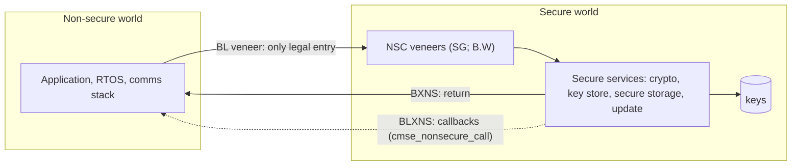
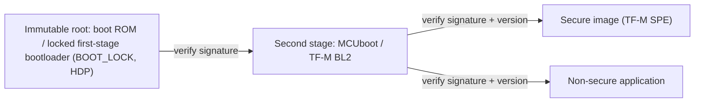

# Module 9: Security — MPU, TrustZone-M, secure boot

**Time:** 5 h (2.5 h theory, 2.5 h lab) · **Board:** NUCLEO-L552ZE-Q · **Lab:** [Partition and lock](lab/README.md)

You'll partition firmware so that a bug in the application can't leak keys or brick the device. Security on a microcontroller is layered. The **MPU** contains mistakes within one privilege domain, **TrustZone-M** separates a small trusted world from everything else, **secure boot** makes sure only your code runs, and **device protections** keep the debugger and the factory bootloader from undoing all of it.

## Learning objectives

1. Configure the ARMv7-M and ARMv8-M MPUs (region/subregion model vs base/limit model) for stack guards, execute-never data and unprivileged tasks.
2. Split an application into Secure and Non-secure worlds with TrustZone-M: SAU, IDAU, GTZC, Non-Secure Callable veneers.
3. Explain a chain of trust from an immutable root through secure boot to the application, including anti-rollback.
4. Apply STM32 device protections: RDP levels, write protection, PCROP/HDP, OEM keys.

---

## 9.1 Threat modelling for embedded devices

Start from **assets** and **attackers**, not from features:

| Asset | Why it matters |
| --- | --- |
| Device identity keys / credentials | cloning, impersonating a device to the backend |
| Firmware (IP, and the update signing chain) | reverse engineering, finding vulnerabilities, malicious updates |
| User data | privacy and regulation |
| Device availability | bricking via malicious updates or erased flash |

| Attacker | Capability | Typical attacks |
| --- | --- | --- |
| Remote | network access only | protocol parsing bugs → code execution; malicious update images |
| Local, non-invasive | physical access, debug probe, UART | read flash over SWD; boot into the system bootloader; downgrade firmware |
| Local, semi-invasive | lab equipment | voltage/clock **fault injection** (glitching past a check), side-channel analysis of crypto |
| Invasive | decapping, microprobing | out of scope for most products; certified secure elements for the rest |

For each asset × attacker pair, decide whether you **prevent**, **detect** or **accept** the risk. Write it down: the capstone asks for a threat model.

## 9.2 The MPU

### ARMv7-M (PMSAv7: Cortex-M3/M4/M7, the H723)

- 8 or 16 regions (the H723's M7 has 16). Region **n+1 overrides n** where they overlap.
- Size is a **power of two** from 32 bytes to 4 GB, and the base must be **aligned to the size**.
- Each region ≥ 256 bytes has **8 sub-regions** that can be disabled individually. This is the standard trick for approximating non-power-of-two areas.
- Attributes: `TEX`/`C`/`B`/`S` (memory type and cacheability, Module 5 §5.7), `AP` (privileged/unprivileged × RW/RO/none), `XN`.
- `MPU_CTRL.PRIVDEFENA` = 1 keeps the default memory map as a background region for **privileged** code. Unprivileged code can only touch what a region explicitly grants.

### ARMv8-M (PMSAv8: Cortex-M23/M33, the L552)

- Regions are **base/limit** pairs at 32-byte granularity: no power-of-two rule, no sub-regions.
- Regions **must not overlap**. An access hitting two regions faults.
- Memory attributes are indirect: `MAIR0/1` hold 8 attribute bytes, and each region picks one by index.
- `AP` is 2 bits: RW/RO × privileged-only/any. There's **no "no access" setting**. Unmapped addresses (with PRIVDEFENA off, or for unprivileged code) and `XN` provide that.
- With TrustZone, there are **two MPUs**: `MPU_S` and `MPU_NS`, banked by security state.

```c
/* ARMv8-M: 32-byte read-only, execute-never guard at the bottom of a stack.
 * A push into it raises MemManage (DACCVIOL, or MSTKERR during exception entry). */
ARM_MPU_SetMemAttr(0, ARM_MPU_ATTR(ARM_MPU_ATTR_MEMORY_(0, 1, 1, 1),    /* outer WB, RA, WA */
                                   ARM_MPU_ATTR_MEMORY_(0, 1, 1, 1)));  /* inner the same */
ARM_MPU_SetRegion(0, ARM_MPU_RBAR((uint32_t)stack, ARM_MPU_SH_NON, 1 /*RO*/, 0 /*priv*/, 1 /*XN*/),
                     ARM_MPU_RLAR((uint32_t)stack + 31, 0));
ARM_MPU_Enable(MPU_CTRL_PRIVDEFENA_Msk);
```

### MPU recipes

| Recipe | How | Catches |
| --- | --- | --- |
| **Null-pointer trap** | a no-access (v7) / XN + unmapped (v8) region over the first 256 bytes–1 KB of the address space | `*NULL` reads and writes and calls through null function pointers. Not usable where 0x0 is real memory (H7 ITCM): reserve those bytes in the linker script first |
| **Stack guard** | a small read-only/no-access region at the bottom of each stack | overflow at the first push, instead of silent corruption |
| **W^X** | RAM regions `XN`, flash regions read-only | injected-code execution and accidental flash writes |
| **Unprivileged tasks** | tasks run with `CONTROL.nPRIV = 1`; per-task regions reprogrammed on context switch (FreeRTOS-MPU) | one task corrupting another's data or the kernel |
| **Peripheral isolation** | regions over peripheral blocks granted only to their driver task | a bug elsewhere poking a peripheral |

On ARMv8-M, **`PSPLIM`/`MSPLIM`** catch stack overflow in hardware without spending an MPU region. Set them per task in the context switch, as FreeRTOS's ARMv8-M ports do.

## 9.3 TrustZone-M

TrustZone-M splits the whole system (memory, peripherals, interrupts, core registers) into a **Secure** and a **Non-secure** world. The core switches state on function calls, with no hypervisor and no exception needed.



### Who decides what is secure

| Unit | Scope | Configured by |
| --- | --- | --- |
| **IDAU** (implementation-defined) | fixed, chip-wide map: on the STM32L5, `0x0C000000`/`0x30000000`/`0x50000000` aliases are Secure, and `0x08000000`/`0x20000000`/`0x40000000` are Non-secure | the silicon |
| **SAU** (security attribution unit) | up to 8 regions (STM32L5) marking address ranges **Non-secure** or **Non-secure Callable**; everything else is Secure | secure boot code |
| **GTZC** (ST's global TrustZone controller) | the *bus side*: **TZSC** sets per-peripheral security and privilege, **MPCBB** sets the security of each 256-byte SRAM block, **MPCWM** sets watermarks for external memories, **TZIC** raises interrupts on illegal accesses | secure boot code |
| Flash option bytes | secure flash area per bank (`SECWMx_PSTRT/PEND`) | provisioning |
| GPIO `SECCFGR` | per-pin security (all pins Secure after `TZEN = 1`) | secure code |

The final attribution of an address is the **more secure** of IDAU and SAU. On top of that, the bus-side controllers decide whether a given **transaction** reaches the memory or peripheral. Both must agree for Non-secure code to use something.

### Crossing the boundary

- **Non-secure → Secure** is possible only through an `SG` instruction located in a **Non-Secure Callable** (NSC) region. The compiler generates one veneer per entry function:

```c
/* secure side, built with -mcmse */
__attribute__((cmse_nonsecure_entry))
int32_t secure_sign(const void *msg, uint32_t len, uint8_t *mac)
{
    /* NEVER trust a Non-secure pointer: it could point at Secure memory
     * (the "confused deputy" attack). */
    if (!cmse_check_address_range((void *)msg, len, CMSE_NONSECURE | CMSE_MPU_READ) ||
        !cmse_check_address_range(mac, 32, CMSE_NONSECURE | CMSE_MPU_READWRITE)) {
        return -1;
    }
    hmac_sha256(k_device_key, sizeof k_device_key, msg, len, mac);
    return 0;
}
```

  The linker places the veneers (`SG; B.W secure_sign`) in `.gnu.sgstubs`, which your linker script puts in the NSC region. `-Wl,--cmse-implib,--out-implib=secure_nsclib.o` produces an import library containing only the veneer addresses. The Non-secure image links against it and never sees anything else. The compiler also **clears registers on return** (including FP registers), so no secure values leak through r0–r3, r12 or s0–s15.

- **Secure → Non-secure**: `BXNS` returns, and `BLXNS` calls a Non-secure function. Mark such function pointers with `__attribute__((cmse_nonsecure_call))`, and the compiler saves and clears secure state around the call.

- **Starting the Non-secure world** from secure boot code:

```c
typedef void (*ns_entry_t)(void) __attribute__((cmse_nonsecure_call));
uint32_t *ns_vectors = (uint32_t *)0x08040000;
SCB_NS->VTOR = (uint32_t)ns_vectors;
__TZ_set_MSP_NS(ns_vectors[0]);
ns_entry_t ns_reset = (ns_entry_t)cmse_nsfptr_create(ns_vectors[1]);
ns_reset();   /* BLXNS: never returns */
```

### Banked and shared resources

Banked per security state: `MSP`/`PSP` (and `MSPLIM`/`PSPLIM`), `CONTROL`, `PRIMASK`/`BASEPRI`/`FAULTMASK`, **VTOR**, **SysTick**, **MPU**, and parts of SCB (fault status, SHCSR). Shared: the NVIC (with `NVIC->ITNS` choosing the target state of each interrupt, Secure by default!) and the general-purpose registers. So the secure world must clear them, which the compiler does.

`AIRCR.PRIS` deprioritises all Non-secure exceptions so they can never preempt Secure ones. `AIRCR.BFHFNMINS` routes BusFault/HardFault/NMI to the Non-secure world (rarely wanted).

### What faults when

| Non-secure code does | Result |
| --- | --- |
| loads/stores a Secure address | **SecureFault** (`SFSR.AUVIOL`, address in `SFAR`), handled in the Secure world |
| branches to Secure code outside an `SG` | SecureFault (`INVEP`) |
| accesses a Secure peripheral or SRAM block via the NS alias | bus error from GTZC (BusFault/HardFault in NS), plus a TZIC interrupt if enabled |

## 9.4 Chain of trust and secure boot



The rules that make it a chain:

1. **An immutable root.** The first code to run can't be modified in the field: a ROM, or flash that is write-protected and locked as the only boot entry. On the STM32L5: `TZEN = 1`, `SECBOOTADD0` pointing at the bootloader, `BOOT_LOCK = 1` so the boot address can't be changed, write protection on its pages, and **HDP** (secure hide protection) so it becomes unreadable once it has run.
2. **Every stage verifies the next** before jumping to it: a **signature** (ECDSA P-256 or Ed25519) over a hash of the image and its header. A CRC detects accidents, not attackers (Module 10).
3. **Anti-rollback.** The image header carries a **security counter**. The bootloader keeps the highest counter it has accepted in monotonic storage (OTP, a write-once flash area, or a secure counter), and refuses older images even when they are validly signed. Otherwise an attacker re-installs last year's firmware with a known vulnerability.
4. **Keys.** The public key (or its hash) of the signer is part of the immutable stage. The private key never leaves the build infrastructure (an HSM or KMS).

On the STM32L5/U5, ST ships two reference implementations: **TF-M** (Trusted Firmware-M, with MCUboot as BL2 and PSA services in the Secure world), and **SBSFU** (X-CUBE-SBSFU, ST's secure boot and secure firmware update). Module 10 builds the update half.

## 9.5 Crypto on chip

- **TRNG**: seeds every key generation and nonce. Health-check it at boot.
- **AES / PKA / HASH accelerators** exist on some parts (the STM32L562 has AES and PKA; the L552 doesn't). Check the datasheet before you design around them.
- **Secure key storage**: keys in Secure flash behind HDP, or in a dedicated secure element (e.g. STSAFE-A, ATECC608) when the threat model includes fault injection.
- **PSA Crypto API** (`psa_sign_hash`, `psa_mac_compute`, …) is the portable interface TF-M exposes to the Non-secure world. The application never sees a key, only a key handle.

## 9.6 STM32 device protections

| Protection | What it does | Reversible? |
| --- | --- | --- |
| **RDP level 0** | no protection | — |
| RDP level 0.5 (TrustZone parts) | Non-secure debug allowed; Secure flash/SRAM and debug of the Secure world blocked | yes |
| **RDP level 1** | debug can't read flash, SRAM2 or backup registers; booting from SRAM/system memory restricted | yes: regression to 0 **mass-erases** the user flash |
| **RDP level 2** | debug port **permanently** disabled, boot from system memory disabled, option bytes frozen | **no**: permanent, no way back, not even for ST |
| WRP | write-protect flash page ranges | while RDP < 2 |
| PCROP (H7 and others) | code in a range can be executed but not read, even by the CPU's data side | with mass erase |
| HDP (L5/U5) | hide a secure area after boot: no access at all until the next reset | — |
| OEM keys (U5 `OEM1KEY`/`OEM2KEY`) | password-protected RDP regression, e.g. for returned devices | — |

**RDP 2 is a one-way door.** Use it only in production, and only after the provisioning flow has been tested on sacrificial units. A device at RDP 2 with a bug in its update path is a brick.

**Regulation.** The EU **Cyber Resilience Act** (Regulation (EU) 2024/2847) applies to most products with digital elements sold in the EU. Its vulnerability and incident **reporting obligations apply from 11 September 2026**, and the full requirements (secure by default, security updates for the support period, a software bill of materials, vulnerability handling) from **11 December 2027**. Secure boot, signed updates and documented threat models stop being "nice to have".

## Knowledge check 9

1. What is the purpose of the Non-Secure Callable (NSC) region?
2. How does the ARMv8-M MPU region model differ from ARMv7-M?
3. Why is RDP level 2 considered irreversible, and what does it disable?
4. What problem does an anti-rollback counter solve in secure boot?

## Further reading

- Arm, *ARMv8-M Security Extensions: Requirements on Development Tools* (CMSE), and the *Armv8-M Architecture Reference Manual*, chapter on the Security Extension.
- ST, *AN5347 STM32L5 Series TrustZone features*.
- ST, *AN4838 Managing memory protection unit in STM32 MCUs*.
- Trusted Firmware-M documentation (trustedfirmware-m.readthedocs.io).
- Joseph Yiu, *The Definitive Guide to Arm Cortex-M23 and Cortex-M33 Processors*, chapters 7 and 18.
- Regulation (EU) 2024/2847 (Cyber Resilience Act), Official Journal of the EU, 20 November 2024.
