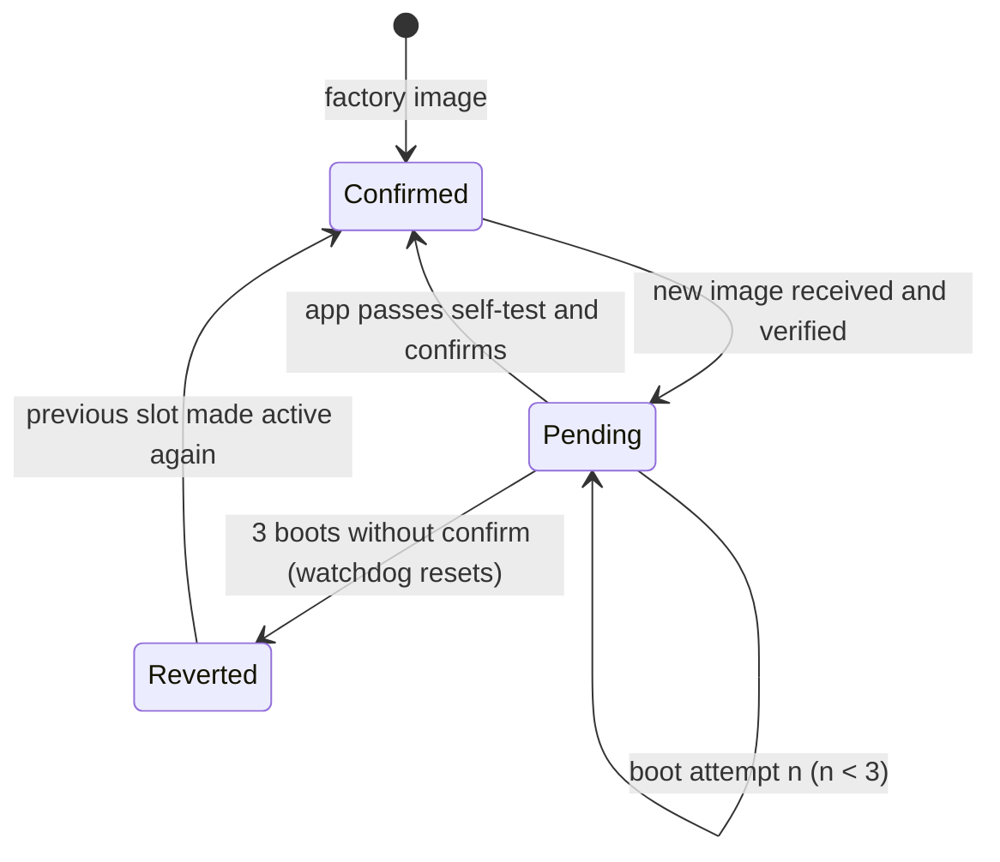

# Module 10: Bootloaders and firmware updates

**Time:** 4 h (1.5 h theory, 2.5 h lab) · **Board:** NUCLEO-H723ZG · **Lab:** [Unbrickable update](lab/README.md)

You'll design an update system that can lose power at any instant and still boot a valid, authenticated image. Firmware update is the feature that turns every other bug into a recoverable one, and if it's wrong, a single bad update turns a fleet into bricks.

## Learning objectives

1. Write a minimal bootloader that validates and jumps to an application safely.
2. Compare update strategies (A/B, swap with scratch, overwrite-only) and their flash, RAM and wear costs.
3. Implement image authentication (Ed25519 or ECDSA P-256 over a hash) and version checks.
4. Design trial boot with confirm/revert and a watchdog safety net.

---

## 10.1 The jump

Handing the CPU to another image is a mini-reset that you perform in software. The application expects the core as it is after reset, and it's your job to provide that:

```c
__disable_irq();
SysTick->CTRL = 0;                               /* SysTick runs on, and its pending flag too */
for (int i = 0; i < 8; i++) {
    NVIC->ICER[i] = 0xFFFFFFFF;                  /* disable every IRQ */
    NVIC->ICPR[i] = 0xFFFFFFFF;                  /* and clear anything pending */
}
deinit_used_peripherals();                       /* RCC reset bits are the cleanest way */
SCB->VTOR = app_vectors;                         /* its table, not ours */
__DSB(); __ISB();
__set_MSP(((uint32_t *)app_vectors)[0]);         /* its stack */
__enable_irq();                                  /* PRIMASK is 0 after reset */
((void (*)(void))((uint32_t *)app_vectors)[1])(); /* its Reset_Handler */
```

Common bugs:

| Symptom | Cause |
| --- | --- |
| App hangs in its clock init | the bootloader left the PLL running as SYSCLK, and the app's init tries to reconfigure it. Either leave the clocks at reset state (the Lab 10 bootloader runs on HSI), or make the app's init robust to a running PLL |
| Random interrupt right after the jump | an IRQ left enabled or pending in the bootloader, now dispatched through the app's vector table |
| App works when flashed alone, not via the bootloader | VTOR not set, or the app linked for the wrong address |
| Fault on the first stack push | MSP not loaded from the app's table |
| App never sees its UART RX | the bootloader left the peripheral in a state the app's driver doesn't expect |

On a part with **TrustZone** the jump is to the Non-secure world (`BLXNS`, Module 9). On a part with an **MPU** enabled in the bootloader, disable it or give the app a well-defined configuration.

## 10.2 Update strategies

| Strategy | Layout | Update | Rollback | Flash cost | Notes |
| --- | --- | --- | --- | --- | --- |
| **Overwrite-only** | bootloader + 1 slot | erase the slot, write the new image | none: a failed update leaves no image, so only the bootloader's recovery mode remains | 1× | smallest; needs a robust recovery path in the bootloader |
| **A/B, direct execute** | bootloader + 2 slots | write the inactive slot, switch | instant: switch back | 2× | images must be linked for their slot (two builds) or position-independent |
| **A/B with bank swap** (STM32H743/753, L5, U5) | 2 flash banks | write the other bank, set `SWAP_BANK` | toggle again | 2× | hardware remaps the banks, so one link address serves both. **Not on the H723**, which is single-bank |
| **Swap with scratch** (MCUboot default) | primary, secondary, scratch | new image in secondary; the bootloader swaps them sector by sector through scratch | swap back | ~2× + scratch | one link address; slow; wears the scratch sector hardest; complex power-fail logic (MCUboot's "swap-move" avoids scratch) |
| **Staging + decompress/decrypt** | small app slot + external flash | download to external flash, then the bootloader installs | from the staging copy | 1× internal + external | standard for OTA over cellular or LoRa; encrypted images at rest |

Flash wear matters. STM32H7 flash is specified for 10 000 erase cycles per sector (check the datasheet for your part). A scratch-sector design that erases scratch once per sector moved burns through it many times faster than the slots.

## 10.3 Image format and authentication

A header in front of every image lets the bootloader decide without executing anything:

```c
struct image_header {          /* modules/10-bootloaders-updates/lab/common/image.h */
    uint32_t magic;
    uint32_t header_size;
    uint32_t payload_size;
    uint32_t version;          /* for choosing between slots */
    uint32_t security_counter; /* anti-rollback (Module 9 §9.4) */
    uint32_t slot;             /* which slot it was linked for */
    uint8_t  reserved[...];
    uint8_t  signature[64];    /* Ed25519 over SHA-512(header without signature || payload) */
};
```

MCUboot uses a similar fixed header plus **TLVs** (type-length-value records) after the image, for the hash, signatures, key ID, dependencies and security counter. TLVs let the format grow without breaking old bootloaders.

**Why a signature, not a CRC.** A CRC detects accidental corruption. An attacker who can deliver an image computes a valid CRC in microseconds. Only a signature, verified with a public key the attacker can't replace (it lives in the immutable bootloader), proves the image came from you.

| Algorithm | Public key | Signature | Verify cost (Cortex-M, software) | Notes |
| --- | --- | --- | --- | --- |
| Ed25519 | 32 B | 64 B | tens of ms | deterministic signing, no nonce pitfalls; small, auditable libraries (Monocypher, TweetNaCl) |
| ECDSA P-256 | 64 B | 64 B | tens to hundreds of ms | FIPS-approved; hardware PKA on some STM32 (L562, U5, H5); MCUboot's common default |
| RSA-2048/3072 | 256/384 B | 256/384 B | fast verify, big keys | legacy |

Sign a **hash** of the image, computed in a streaming fashion over flash, rather than requiring the whole image in RAM.

## 10.4 Transport

| Transport | Typical use | Notes |
| --- | --- | --- |
| UART with XMODEM or a custom framed protocol | factory, service | add per-frame CRC, sequence numbers, and resend on NAK. Lab 10 uses this |
| USB DFU | end-user updates over USB | the STM32 system bootloader speaks it too; `dfu-util` on the host |
| CAN (ISO-TP, or the CiA 302 bootloader profile) | automotive, industrial | |
| OTA via a network co-processor (Wi-Fi, BLE, cellular) | fleets | the application downloads into the inactive slot while running, and the bootloader only switches. Resumable downloads (HTTP range requests, chunk bitmaps) are essential on bad links |

## 10.5 Power-fail safety

Every flash operation can be interrupted. Design so that **every possible interruption point leaves a bootable state**:

1. **Never erase the only good image.** Write the new image somewhere else first (A/B), or keep a recovery path (overwrite-only with a bootloader that can receive an image).
2. **Make the commit a single atomic step.** In Lab 10, an image becomes a candidate only once its signature has been verified *and* one 32-byte boot record has been programmed. Before that, the old record rules.
3. **Use append-only logs for state.** Rewriting a record in place needs an erase, which is a window with no state at all. Appending a new record with a sequence number and a CRC means the newest *valid* record wins, and a half-written one is ignored.
4. **Make each step idempotent.** A swap step interrupted halfway must be safe to redo from the start (MCUboot records swap progress for this).
5. **Know your flash's programming rules.** STM32H7 programs 256-bit words with ECC. Writing a word twice is illegal, and a word interrupted mid-program may read back with a double ECC error, which raises a bus fault/NMI on read. A robust bootloader catches that fault while scanning its state area and treats the word as invalid. STM32L4/L5/U5 use 64-bit double-words with the same "write once" rule.

## 10.6 Trial boot: confirm or revert

A new image that verifies correctly can still be broken: it may crash on start-up, hang, or lose its network connection and so never receive the next fix. The standard pattern:



- The **bootloader** counts boot attempts of a PENDING image, persistently, *before* jumping.
- The **application** confirms only after a meaningful self-test: peripherals up, and ideally after it has talked to the update server, so a build that can't fetch the next update never confirms.
- The **independent watchdog**, started by the bootloader, turns a hang into a reset, which turns into a counted attempt, which eventually turns into a revert. The application must not be able to disable it: on STM32 the IWDG can't be stopped once started. Enable it at power-up via the `IWDG_SW` option bit for maximum assurance.
- **Anti-rollback** interacts with revert. Raise the stored minimum counter only when an image **confirms**, never when it merely boots. Otherwise a broken release raises the floor and makes the good old image unbootable.

## 10.7 Field operations

- **Staged rollouts**: 1% → 10% → 100%, gated on crash rates from the field (Module 8's crash reports, sent home).
- **Update telemetry**: download started/completed, verify result, boot attempts, confirmed/reverted, with the build ID. Without it, a stuck rollout is invisible.
- **Devices that never confirm** come back on the old image. The backend must notice and stop offering the same image forever.
- Keep **two signing keys** (or a key ID in the header) so a compromised key can be rotated with an update signed by the old key.

## Knowledge check 10

1. List four steps a bootloader should perform before jumping to the application.
2. What is the main trade-off between A/B dual-slot and swap-with-scratch strategies?
3. Why should the bootloader verify a signature rather than only a CRC?
4. What role does the independent watchdog play in a trial-boot scheme?

## Further reading

- MCUboot documentation, "Design" (docs.mcuboot.com): image format, swap algorithms, security counters.
- ST, *AN2606* (system bootloader) and *AN3155* (USART protocol used by the ST system bootloader).
- Memfault Interrupt blog: "How to write a bootloader from scratch" and "Device firmware update cookbook".
- RFC 8032, *Edwards-Curve Digital Signature Algorithm (EdDSA)*.
- Monocypher manual (monocypher.org), `crypto_ed25519_check`.
