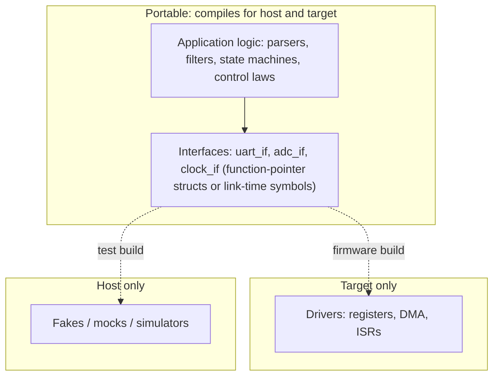

# Module 11: Testing, CI and code quality

**Time:** 3 h (1 h theory, 2 h lab) · **Host PC** (+ NUCLEO-H723ZG for HIL) · **Lab:** [Pipeline](lab/README.md)

Most firmware logic can and should be tested on a PC: parsers, filters, state machines, protocol handling, control laws. On-target testing is slow, flaky and hard to automate, so keep it for what really needs hardware. This module sets up the pipeline that makes host testing routine.

## Learning objectives

1. Structure firmware with a hardware abstraction seam, so business logic compiles and runs on the host.
2. Write unit tests with Unity/CMock or GoogleTest/GoogleMock, including fakes for registers and peripherals.
3. Build a CI pipeline: cross-compile, host tests, static analysis, size tracking, hardware-in-the-loop.
4. Apply coding standards relevant to safety and security (MISRA C:2023, CERT C).

---

## 11.1 Architecture for testability



The rule: **logic never touches registers directly.** It talks to an interface, and the build decides what sits behind it.

Ways to substitute a driver in C:

| Technique | How | Good for |
| --- | --- | --- |
| **Link-time substitution** | the same header (`uart.h`); `uart_stm32.c` in the firmware build, `uart_fake.c` in the test build | simplest; one implementation per binary |
| **Function-pointer interface** | `struct uart_if { int (*write)(void *ctx, const uint8_t *, size_t); void *ctx; }` passed to the module | several implementations at once; dependency injection |
| **Weak symbols** | `__attribute__((weak))` default, overridden by the test | quick seams in legacy code |
| **Preprocessor** | `#ifdef UNIT_TEST` | last resort: the tested code isn't the shipped code |
| **Register fakes** | build the CMSIS structs on the host: `#define USART3 (&fake_usart3)` over a `USART_TypeDef fake_usart3` | testing thin drivers' register sequences |

Lab 4's FIR filter (`fir.c`) and frame builder (`frame.c`) were written with no hardware dependency, so Lab 11 tests them unchanged. The command parser was tangled up with the UART ISR, and extracting it is part of the lab.

## 11.2 Unit-test frameworks

| Framework | Language | Mocks | Notes |
| --- | --- | --- | --- |
| **Unity** + **CMock** (ThrowTheSwitch) | C | CMock generates mocks from headers | tiny, also runs on target; Ceedling wraps both |
| GoogleTest + GoogleMock | C++ (testing C code works fine) | yes | richer assertions, parameterised tests; host only in practice |
| CppUTest | C/C++ | CppUMock | memory-leak detection built in; James Grenning's choice |
| fff (fake function framework) | C | header-only fakes | pairs well with any of the above |

A Unity test file is ordinary C:

```c
#include "unity.h"
#include "cmd_parser.h"

static struct cmd_parser p;
void setUp(void) { cmd_parser_init(&p); }
void tearDown(void) {}

static void test_rate_rejects_zero(void)
{
    struct cmd c;
    const char *s = "rate 0\n";
    while (*s) {
        if (cmd_parser_feed(&p, *s++, &c)) break;
    }
    TEST_ASSERT_EQUAL_INT(CMD_ERROR, c.type);
}

int main(void)
{
    UNITY_BEGIN();
    RUN_TEST(test_rate_rejects_zero);
    return UNITY_END();
}
```

## 11.3 Test-driven development for embedded

James Grenning's cycle: **red** (write a failing test for the next small behaviour), **green** (the simplest code that passes), **refactor** (clean up with the tests as a safety net). Each loop takes minutes, on the host, with no flashing.

Where TDD pays off most in firmware:

- **Protocol parsers and framers**: byte-by-byte state, boundary lengths, garbage input.
- **State machines**: every transition, especially the "impossible" ones.
- **Numeric code**: filters, control laws, fixed-point scaling, overflow at full scale.
- **Anything with edge cases you'd never reproduce on the bench**: wrap-around counters, full buffers, timeouts.

Where it doesn't pay off: thin register-poking drivers (test those with HIL), timing (measure it), and analogue behaviour.

## 11.4 Static analysis

Layer it, cheapest first, and make each layer fail the build:

1. **Compiler warnings as errors**: `-Wall -Wextra -Wshadow -Wconversion -Wdouble-promotion -Wformat=2 -Werror`. `-Wconversion` is noisy on existing code but finds real truncation bugs. In this course it caught an implicit `int` → `uint16_t` narrowing in Lab 4's CRC routine.
2. **cppcheck**: free; finds out-of-bounds accesses, null dereferences, uninitialised variables and resource leaks. Has a MISRA addon (requires the rule texts you've licensed).
3. **clang-tidy**: `bugprone-*`, `cert-*`, `clang-analyzer-*` checks; needs a `compile_commands.json` (`-DCMAKE_EXPORT_COMPILE_COMMANDS=ON`).
4. **A MISRA C checker** (PC-lint Plus, Polyspace, Helix QAC, Parasoft, and others) for products that must claim compliance.

**Triaging.** Every finding is either fixed, or suppressed **inline** with a reason (`// cppcheck-suppress knownConditionTrueFalse ; hardware register reads can change`). A global suppressions file grows into a place where real bugs hide.

## 11.5 Coding standards

| Standard | Scope | Typical use |
| --- | --- | --- |
| **MISRA C:2023** (incorporates the 2012 amendments, covers C11/C18) | ~220 guidelines: "mandatory", "required", "advisory" | automotive (ISO 26262), industrial (IEC 61508), medical, rail |
| **CERT C** | rules and recommendations focused on security (undefined behaviour, integer overflow, string handling) | connected products; complements MISRA |
| **Barr Group Embedded C Coding Standard** | style and bug-prevention rules | teams wanting a pragmatic house standard |

A **deviation** is a documented, justified departure from a MISRA rule. It must record which rule, where (a single site or a project-wide permit), why the rule's rationale doesn't apply or what mitigates the risk, and who approved it. "Required" rules can be deviated; "mandatory" ones can't. Most real projects carry a few: typically for the casts register access needs (rule 11.4, integer-to-pointer), and for `volatile` hardware access patterns.

## 11.6 Dynamic analysis on the host

The target has no MMU, so an out-of-bounds write silently corrupts the neighbouring variable and the bug surfaces somewhere else, hours later. On the host, with the same code:

| Tool | Catches |
| --- | --- |
| **AddressSanitizer** (`-fsanitize=address`) | out-of-bounds reads/writes (heap, stack, globals), use-after-free, double free |
| **UndefinedBehaviorSanitizer** (`-fsanitize=undefined`) | signed overflow, shifts out of range, misaligned access, null dereference, invalid enum values |
| Valgrind memcheck | uninitialised reads, leaks (slower, no recompile) |
| libFuzzer / AFL++ | parser crashes from generated inputs; feed `cmd_parser_feed()` random bytes for an hour |

Use `-fno-sanitize-recover=all` so the first finding fails the test, instead of printing a warning that scrolls by.

## 11.7 Hardware-in-the-loop in CI

Host tests can't see real timing, interrupt interaction, DMA and cache behaviour, peripheral quirks, silicon errata, or power. A small HIL stage catches those regressions:

```
CI server ──► self-hosted runner (a PC or Raspberry Pi) ──USB──► NUCLEO-H723ZG
                │ flash: STM32_Programmer_CLI / OpenOCD / probe-rs
                │ run:   test firmware reports PASS/FAIL over UART or RTT
                │ check: a host script (e.g. tools/lab4_rx.py: 60 s, zero gaps)
```

Keep HIL tests **few, fast and deterministic**: a smoke test per board, plus the timing and throughput checks that host tests can't do. Power-cycle the board between runs (a USB hub with per-port switching) so one hung test doesn't poison the next.

## 11.8 Metrics worth tracking

| Metric | Why | How |
| --- | --- | --- |
| Flash/RAM per image, per commit | creeping growth ends in a board respin | `tools/size_report.py`; fail merge requests that grow more than N bytes |
| Worst-case stack per task | stack overflows are field crashes | `-fstack-usage` + call-graph analysis; HIL high-water marks |
| Host test line/branch coverage | finds untested logic (not proof of correctness) | gcov + gcovr; gate on a floor, ratchet it upwards |
| ISR latency / jitter | timing regressions are invisible to unit tests | HIL measurement as in Lab 3, with a threshold |
| Static-analysis findings | should only go down | fail on new findings |

## Knowledge check 11

1. Give two ways to substitute a hardware driver with a fake in a C unit test.
2. Why run sanitizers on the host build even though the target has no MMU?
3. What is a MISRA deviation and what must accompany it?
4. Name one thing HIL tests catch that host tests cannot.

## Further reading

- James Grenning, *Test-Driven Development for Embedded C* (Pragmatic Bookshelf, 2011).
- ThrowTheSwitch.org: Unity, CMock and Ceedling documentation.
- MISRA, *MISRA C:2023 — Guidelines for the use of the C language in critical systems*.
- SEI CERT C Coding Standard (wiki.sei.cmu.edu).
- Memfault Interrupt blog: "Unit Testing with CppUTest" and "Continuous Integration for Firmware".
